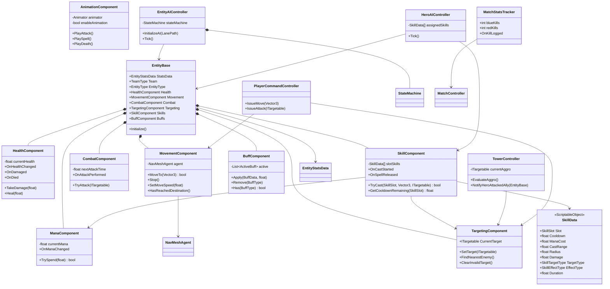

# 《MOBA Demo 迭代计划书》

> 本文档承载**实施细节与阶段计划**，需求权威以 `README.md` 为准。两者冲突时以 `README.md` 为准。
> 交付目标：**带有美术表现、核心机制完整、真正可玩的「简易版英雄联盟」（MOBA Vertical Slice）**。
> 阶段一 ~ 阶段七**已完成并封版**（阶段七实机验收通过）。
> **下一步：阶段八（嚎哭深渊机制与 5v5 团战拓展）——蓝图已写入第 5 章，待架构师审批后实施**；原"美术表现与表现层分离"阶段顺延为**阶段九**。

---

## 1. 项目目标与架构约束

开发一个单机 Unity 3D 顶视角 MOBA Demo，最终验证并交付完整玩法闭环：

> 玩家右键移动/普攻 → 释放指向性 / 非指向性技能 → 双方规律出兵 → 小兵沿兵线推进交战
> → 防御塔按仇恨优先级还击 → 推掉防御塔 → 摧毁敌方基地 → 判定胜负并展示对局信息。

### 核心技术约束

- 使用 Unity 原生 `MonoBehaviour` **组件化架构（ECS 风格）**，不使用纯 DOTS / ECS。
- 每个脚本只承担一个明确职责，避免"上帝类"。
- 静态数值通过 `ScriptableObject` 配置，运行时状态保存在组件实例中，**绝不回写资产**。
- AI 使用基础有限状态机（FSM）；**可移动单位分两条互斥路线**：AI 单位走 FSM，玩家英雄走玩家指令层。
- 移动与追踪使用 Unity 内置 `NavMeshAgent`。
- **表现与逻辑分离（最高优先级铁律）**：逻辑层单向广播事件，表现层只读订阅；**动画与特效绝不能反向影响伤害判定**。
- 仅实现单机逻辑，不设计网络同步、预测、回滚或服务器权威。
- **所有场景装配必须通过 Editor 脚本自动化完成，严禁手动拖拽依赖。**

### 关于"表现与逻辑分离"的边界说明（重要）

| 允许 | 禁止 |
|---|---|
| 逻辑层广播 `OnAttackPerformed` / `OnDamaged` / `OnDied` / `OnSpellCast` 事件 | 逻辑层直接引用 `Animator` / `ParticleSystem` / `AudioSource` / UI 组件 |
| 表现层订阅事件播放动画、特效、音效、飘字 | 用 **Animation Event** 回调伤害结算或修改战斗数值 |
| 动画播放速度按 `AttackInterval` 做视觉适配 | 让逻辑层**等待**动画播完才结算（逻辑节奏与动画长度解耦） |
| 表现层整体关闭 | 关闭表现后对局结果发生变化 |

> 说明：早期草案曾采用"动画事件驱动伤害"，该方案**已废弃**——它会让伤害判定依赖表现层，违反单向数据流。伤害判定的唯一权威是 `CombatComponent`（距离 + CD + 目标合法性）与 `SkillComponent`（CD + 蓝耗 + 施法距离 + 目标合法性）。

---

## 2. 核心目录结构（目标态）

```text
Assets/
├── Art/
│   ├── Models/                     # 🆕 角色与建筑模型（Heroes / Minions / Towers / Bases）
│   ├── Materials/                  # ✅ 地面、角色、阵营材质
│   ├── Animations/                 # 🆕 动画片段与 AnimatorController
│   ├── VFX/                        # 🆕 攻击、受击、技能特效预制体
│   └── Textures/                   # 🆕 地面贴图与 UI 贴图
├── Audio/
│   ├── Music/
│   └── SFX/
├── Scenes/
│   ├── MainScene.scene             # ✅ 主玩法场景（.scene）
│   └── Test/
├── Scripts/
│   ├── Core/
│   │   ├── EntityBase.cs           # ✅ 实体根对象与组件引用入口
│   │   ├── EntityRegistry.cs       # ✅ 实体登记（战场冻结用）
│   │   ├── TeamType.cs             # ✅ 阵营枚举
│   │   ├── EntityType.cs           # ✅ 英雄、小兵、塔、基地类型
│   │   └── Interfaces/
│   │       ├── IDamageable.cs      # ✅（阶段六新增 source 重载，供击杀归属）
│   │       ├── ITargetable.cs      # ✅
│   │       └── （不新建 IStatusReceiver）  # 阶段六裁定：护盾落 HealthComponent、减速/眩晕落 BuffComponent，
│   │                                       # 均为具体组件的公开方法调用；无消费方的接口 = 死代码
│   ├── Components/
│   │   ├── HealthComponent.cs      # ✅ 生命值、伤害、治疗、死亡判定
│   │   ├── ManaComponent.cs        # 🆕 法力值与消耗（阶段六）
│   │   ├── MovementComponent.cs    # ✅ NavMesh 移动、停止、到达判断
│   │   ├── CombatComponent.cs      # ✅ 攻击距离、冷却、伤害结算
│   │   ├── TargetingComponent.cs   # ✅ 目标合法性、搜索与切换
│   │   ├── SkillComponent.cs       # 🆕 技能释放唯一入口（阶段六）
│   │   ├── BuffComponent.cs        # 🆕 状态效果容器（阶段六）
│   │   └── AnimationComponent.cs   # ✅ 逻辑状态 → Animator 参数（阶段九：唯一引用 Animator 的组件）
│   ├── Controllers/
│   │   ├── PlayerCommandController.cs  # ✅ 右键移动/攻击指令
│   │   ├── PlayerSkillController.cs    # ✅ 技能按键输入（阶段六；阶段八扩 QWER 四键）
│   │   ├── HeroAIController.cs         # 🆕 AI 英雄技能决策（阶段八）
│   │   └── CameraController.cs         # ✅ 相机跟随、平移、缩放
│   ├── AI/
│   │   ├── FSM/{IState.cs, StateMachine.cs}   # ✅
│   │   ├── EntityAIController.cs              # ✅
│   │   └── States/{Idle,Move,Chase,Attack,Dead}State.cs   # ✅
│   ├── Units/
│   │   ├── HeroController.cs       # ✅ 英雄（无 FSM，走玩家指令层；含复活）
│   │   ├── MinionController.cs     # ✅
│   │   ├── TowerController.cs      # ✅ 防御塔（含仇恨优先级）
│   │   └── BaseCoreController.cs   # ✅
│   ├── Skills/                     # ✅ 技能数据与效果（阶段六；阶段八扩展）
│   │   ├── SkillSlot.cs            # Q / W 槽位枚举（阶段八扩 E / R）
│   │   ├── SkillCastType.cs        # UnitTarget / GroundPoint（阶段八新增 Self）
│   │   ├── SkillTargetType.cs      # 敌方单位 / 友方单位 / 地面点 / 方向
│   │   ├── SkillEffectType.cs      # 伤害 / 护盾 / 减速 / 眩晕（阶段八新增 EmpowerNextAttack / Heal / ExecuteDamage）
│   │   ├── SkillData.cs            # ScriptableObject 技能配置
│   │   ├── SkillTargetSelector.cs  # 目标选择器（范围敌方 / 指定目标）
│   │   └── SkillEffectResolver.cs  # 效果结算（伤害 / 护盾 / 状态）
│   ├── Gameplay/
│   │   ├── LanePath.cs             # ✅
│   │   ├── MinionSpawner.cs        # ✅ 出生点直接持有 Transform，不引入 SpawnPoint 标记组件
│   │   ├── MatchController.cs      # ✅
│   │   └── MatchStatsTracker.cs    # 🆕 击杀/死亡统计与播报事件（阶段七）
│   ├── UI/
│   │   ├── MatchResultView.cs      # ✅
│   │   ├── WorldHealthBarView.cs   # 🆕 头顶世界空间血条（阶段七）
│   │   ├── DamagePopupView.cs      # 🆕 伤害飘字（阶段七）
│   │   ├── HeroHUDView.cs          # 🆕 头像、血/蓝条、技能 CD（阶段七）
│   │   ├── SkillSlotView.cs        # 🆕 单个技能图标 + CD 遮罩（阶段七）
│   │   ├── MinimapView.cs          # 🆕 小地图映射（阶段七）
│   │   ├── KillFeedView.cs         # 🆕 击杀播报（阶段七）
│   │   ├── ScoreboardView.cs       # 🆕 计分板（阶段七）
│   │   └── RespawnOverlayView.cs   # 🆕 复活倒计时遮罩（阶段七）
│   ├── VFX/                        # ✅ 表现层
│   │   ├── TeamColorView.cs        # ✅ 阵营 × 单位类型 四格配色（阶段八）
│   │   ├── WhiteboxVfx*.cs         # ✅ 白盒占位特效（阶段八；美术资源接入后整体删除）
│   │   ├── SimpleObjectPool.cs     # ✅ 最小可用对象池（阶段九）
│   │   ├── PooledVfxInstance.cs    # ✅ 池化特效的自生命周期与自动回收（阶段九）
│   │   └── VfxSpawner.cs           # ✅ 受击 / 施法 / 弹道命中 → 从池取特效播放（阶段九）
│   ├── Debug/
│   │   ├── FSMDebugView.cs         # ✅ 单位 FSM 观察者（挂单位身上；AI 英雄由工具按实例挂）
│   │   ├── MatchDebugView.cs       # ✅ 对局状态浮层（场景级，挂在工具管理的 DebugViews 上）
│   │   └── TowerAggroDebugView.cs  # ✅ 塔仇恨可视化（阶段八落地，场景级）
│   └── Editor/
│       ├── AutoSceneBuilder.cs                  # ✅ 一键组装（需持续升级，见 §6 铁律）
│       ├── AutoSceneBuilder.Stage8Assembly.cs   # 阶段八：6 塔 + 10 英雄装配
│       ├── AutoSceneBuilder.Stage9Assembly.cs   # 阶段九：AnimatorController 生成 + 动画接线 + 模型/特效槽位
│       ├── AutoSceneBuilder.UIAssembly.cs       # 阶段七：UI 与可视化装配
│       ├── AutoSceneBuilder.VfxAssembly.cs      # 阶段八：白盒视觉反馈（四格配色 + 占位特效）
│       └── AutoSceneBuilder.DebugAssembly.cs    # 阶段八：场景级调试视图装配
├── ScriptableObjects/
│   ├── EntityStats/                # ✅
│   ├── Attacks/                    # ✅
│   ├── Skills/                     # ✅ Q / W 配置；🆕 玩家 QWER + Pool/ 技能池（阶段八）
│   ├── Spawns/                     # ✅
│   └── Match/                      # ✅
├── Prefabs/
│   ├── Characters/                 # 🆕 Heroes / Minions
│   ├── Buildings/                  # 🆕 Towers / Bases
│   ├── UI/                         # 🆕 血条、飘字、HUD、小地图
│   └── VFX/                        # 🆕 弹道、受击、技能特效
└── Settings/
    ├── Input/
    └── NavMesh/
```

---

## 3. 核心类图设计



### 3.1 基类与接口

| 类型 | 职责 |
|---|---|
| `EntityBase` | 统一实体身份、阵营、配置数据及核心组件引用；只负责初始化与聚合。 |
| `IDamageable` | 暴露受伤入口与存活状态，使攻击逻辑不依赖具体单位类型。 |
| `ITargetable` | 暴露目标位置、阵营和可选中状态。 |
| `IStatusReceiver` | 暴露状态效果接收入口（减速/眩晕/护盾），供 Buff 系统统一施加。 |
| `TeamType` | 定义玩家方、敌方和中立阵营，作为目标合法性判断依据。 |
| `EntityType` | 区分英雄 / 小兵 / 防御塔 / 基地，用于依赖校验与塔的仇恨优先级。 |

### 3.2 核心组件

| 组件 | 单一职责 | 主要依赖 |
|---|---|---|
| `HealthComponent` | 管理当前生命、伤害、治疗和死亡事件。 | `EntityStatsData` |
| `ManaComponent` | 管理当前法力、消耗与不足判定。 | `EntityStatsData` |
| `MovementComponent` | 封装 `NavMeshAgent`，处理目标点移动、停止与到达判断。 | `NavMeshAgent` |
| `CombatComponent` | 管理攻击距离、攻击冷却与单次伤害结算（**伤害判定权威**）。 | `AttackData`、`IDamageable` |
| `TargetingComponent` | 搜索敌人、保存目标、验证目标是否有效（**攻击指令的唯一存放处**）。 | `TeamType`、物理查询 |
| `SkillComponent` | 技能施放唯一入口：校验 CD / 蓝量 / 距离 / 目标合法性，扣蓝、起 CD、执行效果、广播事件。 | `SkillData`、`ManaComponent`、`TargetingComponent` |
| `BuffComponent` | 状态效果容器：施加、刷新、到期解除、查询（减速/眩晕/护盾）。 | `IStatusReceiver` |
| `AnimationComponent` | 将逻辑状态转换为 Animator 参数（**唯一允许引用 Animator 的组件**）。 | `Animator` |
| `EntityAIController` | 收集环境条件并驱动状态机，不直接实现状态行为。 | `StateMachine` |
| `HeroAIController` | AI 英雄技能决策：节流评估已分配技能（CD / 蓝 / 射程 / 目标）→ `SkillComponent.TryCast`；**不写 Movement / Combat**（阶段八新增）。 | `SkillComponent`、`TargetingComponent` |
| `TowerController` | 固定位置索敌 + 仇恨优先级评估 + 攻击；不持有移动组件。 | `CombatComponent`、`TargetingComponent` |

> **关于表现层组件为什么不聚合到 `EntityBase`（阶段九自审校准）**
> `AnimationComponent` / `TeamColorView` 都是"挂在实体上、但只订阅事件并写自己的表现"的组件，
> 它们**自己解析**依赖（`GetComponent` / `GetComponentInChildren`），因此不需要 `EntityBase`
> 持有它们的引用。加一个没人读的 `EntityBase.Animation` 属性属于"无消费方的成员 = 死代码"
> （本文件 §2 的同类裁定），而且会诱导逻辑层经它去碰表现 —— 正是 §3.4 铁律要防的方向。
> 类图中 `EntityBase` 的组合关系只保留**逻辑组件**（Health / Mana / Movement / Combat / Targeting / Skill / Buff）。

### 3.3 数据配置类

| 数据类 | 建议字段 |
|---|---|
| `EntityStatsData` | 最大生命、最大法力、移动速度、索敌距离、旋转速度、攻击配置引用。 |
| `AttackData` | 基础伤害、攻击距离、攻击间隔、攻击前摇、命中方式（即时 / 弹道）。 |
| `SkillData` | 槽位、图标、冷却、法力消耗、施法距离、作用半径、伤害/护盾值、效果类型、目标类型、持续时间。 |
| `BuffData` | 状态类型（减速/眩晕/护盾）、数值、持续时间、是否可叠加、刷新策略。 |
| `MinionSpawnData` | 每波数量、生成间隔、波次间隔、单位预制体。 |
| `MatchConfigData` | 开局延迟、复活时间、胜负目标、默认阵营配置。 |

配置数据必须视为只读模板。`currentHealth`、`currentMana`、攻击冷却和当前目标等运行时变量**不得写回 `ScriptableObject`**。

### 3.4 FSM 状态职责

- `IdleState`：无目标时等待或检查下一路径点。
- `MoveState`：沿路线或命令位置移动，并周期性检查敌人。
- `ChaseState`：追踪有效目标；目标失效或超出追击/牵引范围时退出。
- `AttackState`：进入攻击距离后停止移动，并按冷却触发攻击。
- `DeadState`：停止寻路和战斗，禁用选中与碰撞，播放死亡表现。
- 状态只编排组件能力（例如调用 `MoveTo()`、`TryAttack()`）；不得自行修改生命值或直接操作 `NavMeshAgent`。

---

## 4. 关键运行流程

1. `EntityBase.Initialize()` 读取 `EntityStatsData`，初始化各功能组件（**Combat 必须先于 Targeting**）。
2. 玩家右键地面 → `PlayerCommandController` 调用 `MovementComponent.MoveTo()`；右键敌方单位 → 写入 `TargetingComponent.CurrentTarget`。
3. 指令执行器每帧 `ClearInvalidTarget()` → 射程内 `Stop() + TryAttack()`，射程外按 `chaseRepathDistance` 追击。
4. 玩家按 Q/W → `PlayerSkillController` → `SkillComponent.TryCast()` 校验 CD / 蓝量 / 距离 / 目标合法性 → 扣蓝、起 CD、执行效果、广播 `OnSpellCast`。
5. 若技能/普攻命中方式为**弹道**，由 `Projectile` 飞行至目标后**在命中时**回调结算；逻辑层不等待表现。
6. AI 单位由 FSM 根据距离在 `ChaseState` 与 `AttackState` 之间切换。
7. `HealthComponent` 生命归零后发布 `OnDied`：单位控制器执行死亡处理；`MatchStatsTracker` 记录击杀并广播播报事件。
8. 英雄死亡 → 进入复活倒计时（UI 显示）→ 在己方出生点重生并恢复满状态。
9. 基地死亡后通知 `MatchController`，判定胜负、冻结战场并显示对局结果。
10. 防御塔每帧：`ClearInvalidTarget` → 超交战半径 `ClearTarget` → 节流评估仇恨优先级 → `TryAttack`。
11. 全程表现层（血条、飘字、特效、音效、小地图）只订阅事件，**不反向写入任何战斗数值**。
12. AI 英雄（阶段八）：`HeroAIController` 按节流周期评估已分配技能 → `SkillComponent.TryCast`（与玩家共享同一校验链与零副作用保证）；塔普攻为弹道，**命中时**结算。

---

## 5. 分步开发里程碑

### 阶段一：场景、数据配置与玩家移动 ✅ 已完成

**输入**

- 一个可烘焙 NavMesh 的测试地图。
- 玩家占位模型和地面碰撞体。
- `EntityStatsData` 基础移动配置。
- Unity Input System 或旧输入系统中的鼠标点击输入。

**开发范围**

- 建立 `EntityBase`、`MovementComponent` 和 `PlayerCommandController`。
- 完成顶视角相机跟随、平移和缩放。
- 通过鼠标点击地面发送移动命令。
- 提供不可达位置和 NavMesh 外点击的安全处理。

**验收标准**

- 玩家可连续点击不同位置，角色能稳定更新目的地。
- 角色绕过至少一个静态障碍物到达目标点。
- 点击 NavMesh 外区域不会报错或导致角色失控。
- 调整 `EntityStatsData.MoveSpeed` 后，无需修改脚本即可改变移动速度。

---

### 阶段二：生命、目标选择与基础战斗 ✅ 已完成

**输入**

- 阶段一可移动角色。
- 一个敌方静态测试单位。
- `EntityStatsData` 和 `AttackData` 配置。
- 简易生命条预制体。

**开发范围**

- 实现 `HealthComponent`、`TargetingComponent` 和 `CombatComponent`。
- 支持选择敌方目标、追至攻击距离、按冷却执行普通攻击。
- 通过事件刷新生命条并处理死亡。
- 增加目标阵营、死亡状态和攻击距离校验。

**验收标准**

- 玩家不能攻击友方、已死亡或已销毁目标。
- 目标在攻击范围外时角色追击，进入范围后停止并攻击。
- 攻击间隔与伤害数值符合 `AttackData` 配置。
- 目标生命归零后只触发一次死亡事件，攻击与寻路立即停止。
- 更换配置资产后，可生成不同生命值和攻击力的单位。

---

### 阶段三：小兵 FSM 与自动交战 ✅ 已完成

**输入**

- 阶段二完整战斗组件。
- 小兵预制体。
- 至少包含起点、中间点和终点的 `LanePath`。
- 蓝红双方测试单位。

**开发范围**

- 建立 `IState`、`StateMachine` 及五个基础状态。
- 小兵默认沿路线推进，在索敌范围内发现敌人后追击并攻击。
- 目标死亡或超出最大追击范围后，小兵返回路线继续推进。
- 增加 FSM 当前状态与目标的调试显示。

**验收标准**

- 无敌人时，小兵能够依次经过所有路线节点。
- 敌人进入索敌范围后，小兵在一个检测周期内进入追击状态。
- 接近目标后能从追击切换为攻击，目标死亡后恢复推进。
- 被引离路线超过限制时，小兵会放弃目标并返回路线。
- 连续生成至少 10 个小兵运行 3 分钟，无空引用异常或明显状态卡死。

---

### 阶段四：防御塔、兵线生成与胜负闭环 ✅ 已完成

**输入**

- 阶段三的小兵 AI。
- 双方防御塔、基地和出生点预制体。
- `MinionSpawnData` 与 `MatchConfigData`。
- 简易对局结果 UI。

**开发范围**

- 实现 `MinionSpawner`，按配置定时生成双方兵线。
- 防御塔使用固定位置索敌与攻击逻辑，不使用移动组件。
- 基地实现生命值与死亡事件。
- `MatchController` 管理开局、运行、结束三个对局阶段。
- 补充攻击、受击、死亡动画或占位特效。

**验收标准**

- 双方能够按固定间隔自动生成小兵并沿相反方向推进。
- 防御塔只攻击有效敌方目标，目标离开范围或死亡后自动切换。
- 小兵、防御塔和基地复用同一套生命与伤害接口。
- 任一基地生命归零后停止生成单位、停止战斗逻辑并显示胜负结果。
- 从进入场景到对局结束可完整运行至少 5 次，无阻断流程的异常。

---

### 阶段五：英雄控制与自动化基建 ✅ 已完成

> **核心**：基于 Raycast 的右键移动/攻击指令、主相机平滑跟随 + 中键平移 + 滚轮缩放、`AutoSceneBuilder` 一键场景组装（含地面放大与 NavMesh 烘焙）与依赖注入。

**输入**

- 阶段一 ~ 四的完整战场（白盒英雄 + 兵线 + 塔 + 基地）。
- `PlayerCommandController`、`CameraController`、`AutoSceneBuilder`。
- 旧输入系统（`Input.GetMouseButtonDown(1)`）与 Layer `"Ground"` 射线拾取。
- 实机验证前置条件（已由工具自动满足）：地面覆盖战场范围 + 已烘焙 NavMesh。

**交付结果**

- `HeroController`：英雄身份（显示名 / 阵营 / 类型）+ 只读数据（生命 / 移速 / 攻击距离 / 存活）+ 英雄专属死亡收尾。**英雄刻意不挂 `EntityAIController`** —— FSM 会自主索敌并直接写 `MovementComponent` / `CombatComponent`，与玩家指令层争夺同一对组件的写入权（表现为「刚下达的移动令被 AI 改写」）。可移动单位因此分两条**互斥**路线：AI 单位走 FSM，玩家英雄走玩家指令层。英雄没有 `DeadState`，「死亡后原地静止、不再响应输入」由 `HandleDied` 承担。
- `PlayerCommandController`：右键 `Raycast`（`RaycastNonAlloc` 复用缓冲）同时获取敌方单位命中与地面命中，比较命中距离决定**攻击 / 移动**；点自己与友方忽略；点已死亡 / 已销毁单位被 `TargetingComponent.SetTarget` 的合法性校验拦下且不写入指令。攻击指令唯一存放于 `TargetingComponent.CurrentTarget`（全项目「当前目标」只有这一个存放处）。
- 指令执行器：每帧 `ClearInvalidTarget()` → 射程内 `Stop() + TryAttack()` / 射程外按 `chaseRepathDistance` 追击；**玩家指令不设牵引极限**（指令语义就是「打这个」）。`MovementComponent` 判空已提前到射程分支之前，无移动组件的单位不会每帧空引用。
- `CameraController`：固定世界偏移（默认 `(0, 10, -10)`，约 45° 俯角）+ `SmoothDamp`，在 `LateUpdate` 采样（Update 之后才是本帧最终位置），不跟随旋转。**平移与缩放是显示层增量**（`panOffset` / `zoomScale`，均不写进 `offset` 字段）：期望位置 = `目标 + offset × zoomScale + panOffset`，**注视点同步跟随 `panOffset`** —— 否则相机一边横移一边盯着英雄，平移会退化为「绕英雄转圈」，玩家永远推不开视野。
- `AutoSceneBuilder`：一键组装兵线、双方基地与出兵点、`MatchController`、**地面覆盖与 NavMesh 烘焙**、英雄（资产 / 材质 / 预制体 / 实例 / 相机跟随），并做缺口修补与收尾校验；**依赖注入零手工**（全部走 `SerializedObject` + `SerializedProperty`）。
- 步骤 8「地面覆盖、导航烘焙与手工残留自愈」：只放大不缩小 / 只动内置 Plane 网格 / 保持正方形；自动移除 Ground 上手工残留的 `NavMeshSurface` 组件；用现代 API `NavMeshBuilder.CollectSources`（配 `NavMeshBuildMarkup`）显式收集几何 + `BuildNavMeshData` 烘焙，再以 `EditorUtility.CopySerialized` **原地更新**场景的 NavMeshData 资产（保住 guid，场景引用不断链）→ `NavMesh.CalculateTriangulation()` 验证。**不再使用已弃用的 `StaticEditorFlags.NavigationStatic`（CS0618 已消除）**。
- 步骤 1 附加「幽灵对象清理」：名字命中接管清单、却不是场景根对象的游离副本（历史遗留：默认名空对象下挂着的 `BlueBase` / `RedBase` 副本，带残余 `EntityBase` 等组件）会被清掉，避免污染 `EntityRegistry`；判定规则收窄为「名字命中 + 有父节点」，清完即自限。

**本阶段的三条设计裁决（封版口径，不再复议）**

1. **`SpawnPoint.cs` 设计剔除**：`MinionSpawner` 直接持有出生点 `Transform` 即可完成落点绑定，再引入一个没有任何消费方的标记组件属于死代码，违反「单一职责 / 不建无用抽象」。**本阶段不实现该类**，`Assets/Scripts/Gameplay/` 只保留 `LanePath` / `MinionSpawner` / `MatchController`。
2. **相机平移只做中键拖拽**：**不做屏幕边缘平移** —— 边缘平移需要额外的边界阈值、鼠标离开窗口与全屏 / 窗口模式的差异化处理，收益不抵复杂度。中键双击回中作为唯一的视角复位入口。**以此为最终标准。**
3. **导航烘焙的唯一入口是工具，场景里不允许存在手工 `NavMeshSurface`**：手工挂的 `NavMeshSurface`（带 `[ExecuteAlways]`）会在编辑器里**再注册一份** navmesh 数据，且它引用的资产看起来「没人用」，极易被误删。工具在步骤 8 自愈式清理这类组件，并用现代 API 原地更新场景的 NavMeshData 资产。**推论（踩坑教训）**：任何**按 guid 被场景引用**的资产都不能用 `AssetDatabase.CreateAsset` 覆盖重建 —— 它会先删除旧资产、guid 随之改变、场景引用直接断链；必须**原地更新内容**（`EditorUtility.CopySerialized`）。

**开发范围（正式定义）**

- **英雄指令层**：Raycast 拾取 → 攻击/移动判定 → 指令执行器；支持连续下达与指令打断。
- **主相机**：平滑跟随 + 中键拖拽平移（双击回中）+ 滚轮缩放；`LateUpdate` 采样；编辑模式可即时摆位。
- **自动化基建**：`AutoSceneBuilder` 完成"清理旧场景 → 生成兵线/建筑/地面与 NavMesh/英雄/相机 → 注入全部 `[SerializeField]` 依赖 → 收尾校验"的全链路，**幂等且零手工拖拽**。
- 纯白盒验证：**本阶段不引入任何美术资产、动画或特效**。

**验收结果**

| 验收项 | 结论 | 依据 |
|---|---|---|
| 连续发出 20 次移动/攻击指令（含 NavMesh 外、点自己、点友方、点已死亡单位），零异常、零失控 | ✅ 闭环 | NavMesh 外 → `NavMesh.SamplePosition` 失败即忽略并告警；点自己 / 友方 → 跳过该命中并继续看它身后的地面；点已死亡单位 → `IsValidTarget` 校验拦下，指令不生效 |
| 点击敌方单位后英雄自动追至射程并持续平A；目标死亡后停止攻击且不残留失效指令 | ✅ 闭环 | 追击按 `chaseRepathDistance` 重寻路（含 `wasAttackingInPlace` 无条件重下，防「停下输出后卡死」）；射程内 `Stop() + TryAttack()`，冷却由 `CombatComponent` 判定；目标死亡 → `ClearInvalidTarget()` 清空 `CurrentTarget`，指令自然作废 |
| 相机跟随无抖动；平移与缩放不改变跟随目标与跟随偏移；连续平移/缩放 30 次无漂移 | ✅ 闭环 | `SmoothDamp` 在 `LateUpdate` 收敛；`target` / `offset` 字段无任何写入路径；平移夹在 `maxPanDistance` 内、缩放夹在 `[minZoomScale, maxZoomScale]` 内，无累积漂移 |
| 英雄在已烘焙 NavMesh 上无卡死；`MoveTo` 失败有一次告警且能自愈重试（不出现"永久卡死"） | ✅ 闭环 | `MoveTo` 返回 bool，失败不置「已下令」标记 → 下一帧自然重试；「代理不在 NavMesh 上」「目标点不可达」各只告警一次（`hasReportedXxx`） |
| **`AutoSceneBuilder` 幂等性**：连续执行 3 次，场景结构与依赖注入结果完全一致，无重复对象、无丢失引用 | ✅ 闭环 | 只按固定名字清理自己生成的对象；资产「缺失才创建、不覆盖」；地面「只放大不缩小」，第二次执行即判定为已覆盖 |
| **零手工验证**：全新克隆仓库 → 打开 `MainScene` → 执行一次菜单 → 直接 Play，完成一次完整对局（出兵 → 交战 → 基地摧毁 → 结算），全程**未在 Inspector 拖拽任何引用** | ✅ **实机确认** | 地面放大与 NavMesh 烘焙已由工具步骤 8 自动完成；右键移动控制已实机验证通过 |
| Profiler：白盒稳态 GC Alloc ≤ 1 KB/帧，单帧逻辑耗时 < 2 ms | ⏳ 待采样 | 需实机 Profiler 采样确认。**已知风险点**：`TargetingComponent.FindNearestEnemy` 使用 `Physics.OverlapSphere`（每次调用分配数组），单位数量上升时应替换为 `OverlapSphereNonAlloc` |

> **封版说明**：本阶段已实机验证「右键移动控制」与「一键组装（含地面 / NavMesh 前置）」；其余验收项为代码级闭环确认（逐条对照实现路径核对）。Profiler 指标属量化采样项，留待阶段六开发前用 Profiler 补测。

---

### 阶段六：技能系统与战斗拓展（核心玩法闭环）✅ 6A 已完成（实机验收通过）/ 6B（塔仇恨）顺延——已并入阶段八落地

> **拆版说明**：本阶段按架构师裁决拆为 **6A（技能系统与战斗拓展）** 与 **6B（防御塔仇恨优先级）**。
> 6A 范围 = 下述 (1)~(5)，代码已交付且编译 / 资产注入 / 静态检查均已通过，**实机技能验收（`Stage6AutoTester`）待跑**；
> 6B 范围 = 下述 (6)，本轮【不做】。

> **核心**：引入完整的技能架构（`ScriptableObject` 驱动的 `SkillData`）。
> **机制**：指向性技能（弹道 Projectile）、非指向性 AOE 技能、基础 Buff/Debuff（减速、眩晕），以及技能 CD 与蓝耗管理。

**输入**

- 阶段五的英雄指令层与相机流。
- `TowerController`（已就位但尚未挂载到预制体/场景）。
- 技能数据结构设计（`SkillData` ScriptableObject）。
- 法力值组件 `ManaComponent`、状态效果容器 `BuffComponent`。

**开发范围**

**（1）技能系统架构**

- **数据层**：`SkillData`（槽位、图标、冷却、蓝耗、施法距离、作用半径、伤害/护盾值、效果类型、目标类型、持续时间）。
- **效果层**：`SkillEffectType`（伤害 / 护盾 / 减速 / 眩晕）+ 目标选择 + `SkillEffectResolver`（效果结算）。
  **实现期裁定（阶段六）**：不建名为 `SkillTargetSelector` 的独立类型 ——「目标选择」由三处各自承担：
  `SkillCastType`（`UnitTarget` / `GroundPoint`，决定这次施法需要一个什么目标）、
  `SkillComponent.TryValidateTarget`（指定敌方单位的合法性）、`AreaEffectZone` 的半径收集（范围内敌方）。
  功能全覆盖，只是不引入一个只做转发的中间层。
  **已知扩展点**：「指定友方单位」当前【未实现】—— `TryValidateTarget` 只接受敌方单位。
  README §2.1.2 把「对指定友方施加护盾」列为技能形态之一，但**不在首批 Q/W 范围内**；
  将来做友方护盾技能时需在此处扩展（`SkillEffectType.Shield` 与 `SkillEffectResolver.ApplyShield` 已就位，只差目标校验放行友方）。
- **执行层**：`SkillComponent.TryCast(slot, groundPoint, target, out failReason)` 唯一入口 —— 校验 CD → 蓝量 → 施法距离 → 目标合法性 → 扣蓝 → 起 CD → 执行效果 → 广播 `OnSpellCast`；被拒绝时通过 `failReason` 给出可读原因（含剩余冷却 / 所需与当前法力 / 实际距离与射程 / 目标阵营）。
- **输入层**：`PlayerSkillController` 采集 Q/W 按键与鼠标位置（非指向性技能需要方向/落点）。
- 首批技能：**Q = 指向性非穿透弹道**（锁定敌方单位 → 弹道命中结算伤害并销毁）；**W = 非指向性 AOE 减速圈**（指定落点 → 持续范围效果 → 周期减速）。

**（2）指向性技能与弹道**

- 锁定目标 → 发射 `Projectile`（真实飞行时间）→ **命中时**结算伤害与效果。
- 目标在弹道飞行途中死亡/销毁时，弹道须安全回收，不得空引用。

**（3）非指向性 AOE 技能**

- 以指定落点/方向为中心，`OverlapSphereNonAlloc` 收集范围内敌方单位并结算；友方与中立不受影响。
- 作用范围需要**白盒可视化**（Gizmos 或临时圆环）便于验证与调试。

**（4）Buff / Debuff**

- `BuffComponent`（状态类型：减速 / 眩晕 / 护盾、数值、持续时间、叠加与刷新策略）。
  **实现期裁定（阶段六）**：不单独建 `BuffData` 资产 —— V1 的 buff 参数（减速比例、减速时长、眩晕时长、护盾值）全部来自 `SkillData`，
  而当前**没有任何"独立于技能的 buff 来源"**（装备 / 光环 / 中立生物光环）。建出来就是无消费方的死代码，
  与 README §3.5「数据层 = `SkillData`」一致，也与本项目「无消费方的标记组件 = 死代码」的既有裁决同一标准
  （参见阶段五"不做 `SpawnPoint.cs`"）。将来出现非技能来源的 buff 时再抽 `BuffData`，
  届时 `BuffComponent.ApplySlow / ApplyStun / ApplyShield` 的签名无需改动。
- 减速：修改移动速度（只经 `MovementComponent.SetMoveSpeed()`，禁止直接改 `NavMeshAgent`）。
- 眩晕：禁止移动与攻击，到期自动解除。
- 护盾：优先吸收伤害，耗尽或到期移除。

**（5）CD 与蓝耗管理**

- `ManaComponent`：当前法力、消耗、不足判定，事件广播供 HUD 订阅。
- 技能冷却剩余时间可查询（供阶段七的 CD 遮罩读取）。

**（6）防御塔仇恨优先级**（⚠️ 已拆分为 **6B**，本阶段【不做】）

> **拆版裁定（架构师 D5）**：「本阶段绝对不碰防御塔仇恨，保持目标纯粹。」
> 本节内容连同下方验收标准里的「塔仇恨」条目一并顺延到 **6B** 单独实施。
> 6A（技能系统与战斗拓展）已按上述 (1)~(5) 封版；`TowerController` 仍处于"已就位、未挂载"状态。
> **2026-09-25 更新**：6B（塔仇恨 + 塔普攻弹道化）已并入**阶段八**（嚎哭深渊 5v5 团战）落地，不再单独成阶段。

- 默认优先级 **小兵 > 英雄**（同级取最近）；敌方英雄在塔范围内攻击己方英雄 → **仇恨转移到该英雄**；目标死亡/离场/非法 → 重选；重评估节流 ≤ 0.25 s；**同一时刻单目标**。
- 新增 `TowerAggroDebugView` 可视化当前仇恨目标与优先级判定结果。（随 6B 顺延 → **阶段八已落地**，见阶段八 §（11）自检记录第 4 项）

**验收标准**

- **技能拒绝路径**：CD 中 / 蓝量不足 / 超出施法距离 / 目标非法（友方、已死亡、已销毁）时，释放被拒绝且**不产生任何副作用**（不扣蓝、不起 CD、不播动画、不生成特效）。
- **拒绝原因可观测**：上述每一条拒绝路径都必须通过 `TryCast` 的 `failReason` 出参给出**可读且带量化信息**的原因（剩余冷却秒数 / 所需与当前法力 / 实际距离与射程 / 目标阵营 / 前摇硬直剩余时间），并由 `PlayerSkillController` 打进 Console —— **不允许只输出"被拒绝"三个字**（使用者无法区分"按了没反应"的具体成因，是最消耗调试时间的一类体验问题）。
- **小兵可被控制**：减速 / 眩晕等状态效果对所有可被选中的敌方单位生效，**不限于英雄** —— 因此 `MinionPrefab` 必须挂载 `BuffComponent`（缺它时效果无处落地，且只在运行期打一条告警后静默放弃）。
- **Q（指向性非穿透弹道）**：锁定敌方单位后发射弹道，**命中时**才结算伤害；`maxHitCount = 1` 保证非穿透（命中即销毁）；CD / 蓝耗 / 射程 / 弹速 / 伤害与 `SkillData` **完全一致**；改资产即可改技能，无需改代码。
- **W（非指向性 AOE 减速）**：以指定落点为中心，`OverlapSphereNonAlloc` 收集范围内**敌方**单位并周期施加减速，友方与中立零影响；减速生效期间移速符合配置且**到期精确恢复原值**；CD / 蓝耗 / 半径 / 减速比例 / 持续时长与 `SkillData` **完全一致**。
- **弹道**：有可见飞行时间，**命中与伤害结算严格一致**（不允许"先扣血、后飞弹"）；目标中途死亡时弹道安全回收，无空引用。
- **Buff/Debuff**：减速生效期间移速符合配置且到期恢复原值；眩晕期间无法移动与攻击；重复施加按既定策略（刷新时长）执行，不产生叠加失控。
- **蓝耗**：法力不足时无法施法；法力随时间/事件回复（若配置）符合预期。
- **塔仇恨**（⏭️ 顺延至 6B，本阶段不验收）：默认打小兵；英雄 A 在塔范围内攻击己方英雄后，塔在 **1 个重评估周期（≤ 0.25 s）内**把仇恨切到英雄 A；英雄 A 离开交战半径或死亡后，塔在 1 个周期内回到小兵；**塔不会同时攻击两个目标**。
- 技能释放瞬间 GC Alloc ≤ 1 KB；战斗中不因技能产生持续 GC。
  **实现期说明（阶段六）**：施法路径上的**可避免分配已清零**（范围场对象名由字符串插值改为常量，省掉每次施法一次 string 分配）。
  但弹道 `Instantiate` / `Destroy` 与范围场 `new GameObject` 属**每次施法的固有分配**（数百字节 ~ KB 级），
  处于该阈值的边界。**测量前提**：关闭 `SkillComponent.logCastEvents` 与 `PlayerSkillController.logCastCommands`
  （调试日志的字符串插值会额外分配，开着必然超标）。**彻底归零**依赖阶段九的对象池，已在架构草案 §7 登记为已知风险点。
- **表现关闭一致性**：禁用全部技能特效后，技能伤害与胜负结果完全一致。

---

### 阶段七：信息可视化与对局 UI（玩家心流体验）✅ **[x] 已完成**（2026-09-25 封版，实机验收通过）

> **核心**：世界空间（World Space）血条显示、伤害飘字（Damage Popups）、小地图（Minimap）映射、屏幕顶部的击杀播报与计分板。
> **机制**：英雄死亡后的复活倒计时与出生点重生机制。

**输入**

- 阶段六的技能与战斗逻辑（白盒表现）。
- 血条、飘字、HUD、小地图预制体与 UI 素材。
- `MatchStatsTracker`（击杀/死亡统计与播报事件）。
- `MatchConfigData` 中的复活时间配置。

**开发范围**

**（1）世界空间血条**

- `World Space Canvas` 跟随单位头顶；敌我配色（敌方红 / 友方绿）；始终 billboard 朝向相机。
- 由 `OnHealthChanged` 事件驱动更新，**禁止每帧轮询**。
- **池化复用**，禁止每个单位 `Instantiate` 一个 Canvas；支持满血隐藏与超出视野裁剪。

**（2）伤害飘字**

- 伤害/治疗数字从受击位置飘出并淡出；由 `OnDamaged` 事件驱动。
- 必须池化；连续战斗下对象数量稳定。

**（3）玩家 HUD**

- 英雄头像（死亡置灰）、生命条、法力条、Q/W 技能图标 + **Radial Fill 冷却遮罩** + 秒数倒计时。
- 数据全部来自事件订阅（`OnHealthChanged` / `OnManaChanged` / 技能冷却查询）。

**（4）小地图**

- 世界坐标 → 小地图坐标映射；显示双方单位、防御塔与基地；英雄用更醒目的标记。
- 单位死亡/销毁后小地图标记同步移除，无残留。

**（5）击杀播报与计分板**

- `MatchStatsTracker` 统计双方击杀/死亡，广播播报事件。
- `KillFeedView`：屏幕顶部消息队列（谁击杀了谁），自动淡出，不阻塞不重叠。
- `ScoreboardView`：双方击杀数/死亡数实时显示。

**（6）复活机制**

- 英雄死亡 → 禁用输入与碰撞 → `RespawnOverlayView` 显示复活倒计时 → 倒计时结束在己方出生点重生并恢复满生命/满法力 → 恢复输入与可选中。
- 复活时间从 `MatchConfigData` 读取；对局结束时不再复活。

**验收标准**

- 血条位置与实体头顶偏差 **< 5 px**（1080p），billboard 始终朝向相机；同屏 20 个血条不产生逐帧 GC。
- 血条数值与实体实际生命实时一致（事件驱动，**无每帧轮询**）。
- **飘字**：每次伤害产生一个飘字，数值与 `TakeDamage` 实际扣血量一致；连续战斗 3 分钟后池对象数量稳定不增长。
- **HUD**：血/蓝条与实体数值一致；**CD 遮罩进度与技能实际可释放时刻一致（误差 ≤ 0.05 s）**；死亡时头像置灰且技能不可点。
- **小地图**：英雄标记位置与实际世界位置映射误差 ≤ 1 个标记宽度；单位死亡后标记 1 帧内移除。
- **击杀播报**：每次击杀恰好产生 1 条播报；连续 10 次击杀播报不重叠、不丢失、自动淡出。
- **计分板**：击杀数与 `MatchStatsTracker` 统计完全一致，无重复计数。
- **复活**：死亡到复活的耗时与 `MatchConfigData` 配置一致（误差 ≤ 0.1 s）；复活后满血满蓝、位置在己方出生点、可正常移动与施法；对局结束后不再复活。
- 同屏 30 单位 + 全部 UI 开启时 ≥ 60 FPS，UI 相关稳态 GC Alloc ≈ 0 B/帧。

**交付结果（2026-09-25 封版）**

| 项 | 交付内容 |
|---|---|
| 世界空间血条 | `WorldHealthBarManager` + `WorldHealthBarView`：管理器订阅 `EntityRegistry` 统一挂载（**单位预制体零改动**）；锚点取碰撞体包围盒顶部（绑定时一次性测量并缓存偏移）；billboard = 复制相机旋转；恒定屏幕像素高度 = 缩放 ∝ 与相机距离；满血 / 死亡 / 相机背后三条显隐规则；护盾覆盖层 |
| 伤害飘字 | `DamagePopupManager` + `DamagePopupView`：**共享世界空间画布**（1 draw call、1 次 billboard）+ 单管理器循环 Tick（不给每个飘字挂 `Update`）；池预生成 32；上浮（easeOutQuad）+ 缩放脉冲 + 淡出 |
| 玩家 HUD | `HeroHUDView` + `SkillSlotView`：头像（死亡置灰）+ 血条 + 蓝条 + Q/W 技能槽（图标 / 蓝耗 / 按键 / 秒数）；CD 径向遮罩每帧读 `GetCooldownRemaining`，**秒数只在整秒跳变时写文本** |
| 小地图 | `MinimapView`：世界 XZ → 小地图 XY 等比例映射（映射范围取地面覆盖包围盒，**与 NavMesh 烘焙同源**）；标记池化 + 登记/注销事件驱动；英雄用更醒目的独立标记；死亡即隐藏、复活自动重现 |
| 击杀播报与计分板 | `MatchStatsTracker`（**唯一计数器**，只统计英雄击杀，归属读 `HealthComponent.LastDamageSource`）+ `KillFeedView`（固定 5 槽位、下移式 FIFO、自动淡出）+ `ScoreboardView`（只读统计器，不自己计数） |
| 复活机制 | `MatchController` 统筹倒计时（读 `MatchConfigData.RespawnTime`，对局结束不再复活）+ `HeroController.Revive()` 执行逆操作（满血满蓝、回出生点、恢复寻路/碰撞/选中/输入）+ `RespawnOverlayView`（挂常驻物体，只开关面板） |
| 逻辑层增量 | `HealthComponent.OnDamaged(HealthComponent,float,float,EntityBase)` + `Revive()`、`ManaComponent.RestoreFull()`、`EntityRegistry.OnEntityRegistered/OnEntityUnregistered`、`MatchConfigData.respawnTime`、`HeroController.Revive/OnHeroRespawned` —— **全部为新增成员，阶段一~六代码零改动** |
| 对象池 | `Core/PrefabPool.cs` 泛型组件池：血条 / 飘字 / 小地图标记共用（阶段八 VFX 可直接复用）；池空返回 null + 一次性告警（**绝不 Instantiate**）；归还只 `SetActive(false)`，视图在自身 `OnDisable` 里退订与复位 |
| 自动化基建 | `AutoSceneBuilder` 改 `partial` 并拆出 `AutoSceneBuilder.UIAssembly.cs`（步骤 17）：一键生成全部 Canvas / 血条 / HUD / 小地图 / 播报 / 复活遮罩并注入全部引用；占位白图与内置字体三级回退；`ValidateUISetup` 给出确定性校验结论 |
| 工程前置 | `Packages/manifest.json` 加入 `com.unity.ugui: 1.0.0`（编辑器内置包，**离线可解析**）。**TextMeshPro 不在内置包清单** → 本阶段全部文字走 uGUI 旧版 `Text` |

**验收结果**

| 验收项 | 结论 | 依据 |
|---|---|---|
| 血条位置偏差 < 5 px（1080p）、billboard 始终朝向相机 | ✅ 实机确认 | 复制相机旋转 + `localScale ∝ 距离`；滚轮缩放时屏幕像素高度恒定 |
| 同屏 20 血条无逐帧 GC、数值事件驱动（无每帧轮询） | ✅ 闭环 | 数值只走 `OnHealthChanged` / `OnShieldChanged`；每帧只写 Transform，无字符串、无 foreach 分配 |
| 每次伤害 1 条飘字、数值 = 实际扣血量 | ✅ 实机确认 | `OnDamaged` 第一参数即"实际扣减量"；被护盾完全吸收时画灰蓝"吸收 N"（保证"每次伤害必有反馈"） |
| 连续战斗 3 分钟池对象数量稳定不增长 | ✅ 实机确认 | 池预生成 + `Release` 复位；池耗尽只隐藏、不影响逻辑 |
| HUD 血/蓝条与实体数值一致 | ✅ 实机确认 | 事件驱动（`ManaComponent` 内部已按 0.5 点节流广播） |
| CD 遮罩进度与实际可释放时刻误差 ≤ 0.05 s | ✅ 实机确认 | 每帧读 `GetCooldownRemaining`（60 FPS 下单帧误差 ≤ 16.7 ms） |
| 死亡时头像置灰、技能不可点 | ✅ 实机确认 | 置灰订阅 `OnDied`；"不可点"由 `SkillComponent.TryCast` 自身的 `IsDead` 校验保证（表现层不参与规则判定） |
| 小地图映射误差 ≤ 1 标记宽、死亡 1 帧内移除 | ⏳ 待补一次实机确认 | 映射范围与地面 / NavMesh 同源；标记在 `LateUpdate` 按 `IsDead` 隐藏（同一帧伤害结算 → 至多下一帧消失） |
| 每次击杀恰好 1 条播报、连续 10 次不重叠不丢 | ✅ 实机确认 | 固定 5 槽位 FIFO + 下移式队列；唯一计数器 |
| 计分板与统计完全一致、无重复计数 | ✅ 实机确认 | 计分板只读 `MatchStatsTracker`（结构性保证，而非两处各自算对） |
| 复活耗时与配置一致（≤ 0.1 s）、满血满蓝、在出生点、可移动施法 | ✅ 实机确认 | `RespawnRoutine` + `Revive()` 的 9 步逆操作（**先启用 agent 再 `Warp`**，并校验 `isOnNavMesh`） |
| 对局结束后不再复活 | ✅ 闭环 | `MatchController.IsMatchOver` 早退 + `StopRespawnCountdown()` |
| 同屏 30 单位 + 全部 UI 开启 ≥ 60 FPS、UI 稳态 GC Alloc ≈ 0 B/帧 | ⏳ 待 Profiler 采样 | 与阶段五同口径：量化采样项留待阶段八开发前用 Profiler 补测（风险点见"已知风险"） |

**本阶段的四项设计裁决（封版口径，不再复议）**

1. **`OnDamaged` 的发送者放在第一个参数**（`Action<HealthComponent, float, float, EntityBase>`）：受伤是高频事件，带上发送者后飘字管理器可以用**一个无捕获回调**订阅全部单位；若按单位建闭包，每次订阅都会产生一次堆分配，直接顶掉"稳态 GC ≈ 0"的验收目标。
2. **血条与飘字不由单位挂载**，而由管理器订阅 `EntityRegistry` 统一挂 / 还池：换来的是**单位预制体零改动**、动态小兵自动覆盖、逻辑层零 UI 引用（禁用管理器 = 关掉全部血条，对局结果完全不变，符合"表现层可整体关闭"铁律）。
3. **小地图标记的显隐用"每帧读 `IsDead`"而不是订阅 `OnDied`**：英雄死亡后并不注销（它会复活），用事件就必须再补一个"复活 → 显示"的事件并成对维护；读一个 bool 字段零成本，且天然覆盖"死亡隐藏 → 复活重现"整条链路。
4. **补装既有缺口**：`MatchResultView`（阶段四已验收的类）此前**从未被任何工具装配进场景**——基地被摧毁后屏幕上什么都不显示。步骤 17 现已创建它并注入 `matchController`（**未改动其任何代码**，遵守 D5"本轮不碰 MatchResultView"）。

**已知风险（登记，不阻断封版）**

- 世界空间 UI 的批次成本：每条血条是一个独立的 World Space Canvas（无法跨 Canvas 合批）→ 24 条血条 = 24 次 draw call。在 60 FPS 预算内；若超标，只需把 `WorldHealthBarView` 内部换成"屏幕空间投影"实现，**对外契约（`Bind` / 事件订阅）完全不变**。
- 世界空间 UI 会被场景几何遮挡（Canvas 默认 `ZTest LEqual`）：阶段九用"UI 专用 Layer + 只渲染该层的第二相机"解决。
- 阶段六遗留：`TargetingComponent.FindNearestEnemy` 使用 `Physics.OverlapSphere`（每次调用分配数组）→ 会让"UI 稳态 GC ≈ 0"的实测被它掩盖，建议顺手换成 `OverlapSphereNonAlloc`（`AreaEffectZone` 已有同族范式）。

> **阶段七之外的收尾补丁（同日）**：白盒期尸体清理——新增 `Core/EntityVisuals.cs` 统一开关渲染器；英雄 `HandleDied` 隐藏肉身 / `Revive` 恢复；小兵 `EntityAIController` 隐藏 + `corpseLingerSeconds`（默认 2 秒）后销毁整个 GameObject。该补丁属白盒期权宜手段，**阶段九接入真实模型与死亡动画后应由表现层接管，届时删除这两处调用点即可**。

---

### 阶段八：嚎哭深渊机制与 5v5 团战拓展 🚧 第一步 + 第二步代码已落地，待实机复验

> **核心**：对标《英雄联盟》"嚎哭深渊 (ARAM)"的单线团战体验——桥梁地形 + 6 座激活防御塔（含 6B 塔仇恨落地与塔普攻弹道化）+ 10 英雄 5v5（1 玩家 + 9 AI）+ 玩家英雄 QWER 四技能 + AI 英雄技能池随机分配 + 兵线节奏 ×2。
> **状态**：蓝图已获架构师批准。**第一步（桥梁地形 + 6 塔 + 10 英雄实例化）已落地并通过一键组装**，第一轮实机验证暴露的三个 Bug 已修复；**第二步（玩家 QWER 重构 + 技能池固定 seed 分配 + `HeroAIController` 技能决策实装）代码已全部落盘**，同批还修掉了第二轮实机暴露的地图寻路 / 碰撞类问题（见本节末两份「实机修复记录」）。**第三轮（架构师指令）已落地：英雄编制强控为 5v5（蓝 1 玩家 + 4 AI / 红 5 AI，附 `ValidateHeroRoster`）、实体配色改为「阵营 × 单位类型」四格表（蓝/红英雄 + 白/黑小兵）、AI 专属技能池扩到 10 个技能且每人无放回抽 4 个挂 QWER（附 `ValidateAiSkillAssignment`）**（见 §（11））。第四轮（实机打回）已修复两个静默失效：小兵配色注入（旧字段名导致资产里的值被静默丢弃）与 AI 技能被运行期共享模板覆盖（见 §（12））。**待办：重跑菜单「一键组装测试战场」+ 实机复验**（场景现在由工具自动保存，见 §（9））。

**输入**

- 阶段七封版的完整对局（白盒形态，含 UI、复活与击杀统计）。
- `TowerController`（已就位、未挂载——6B 顺延至此正式落地）。
- 阶段六技能四层架构（数据 / 效果 / 执行 / 表现）与 `Projectile` / `AreaEffectZone` 效果载体。

**开发范围**

**（1）地图与防御塔基建**

- **桥梁地形**：`AutoSceneBuilder` 步骤 8 放开「保持正方形」约束 → 地面横向拉长为**矩形桥梁**；NavMesh 烘焙范围随之调整为新包围盒；小地图映射范围与烘焙同源，自动适应（零额外代码）。
- **塔布局**：双方各 3 座、共 6 座，沿桥中线对称分布（原有近基地 2 座保留 + 每方各新增 2 座中路塔）；位置常量收进工具脚本（幂等清理按固定名字）。
- **6B 塔仇恨落地**：默认优先级小兵 > 英雄（同级取最近）；敌方英雄在塔交战半径内**攻击己方英雄** → 仇恨立刻转移（挂接 `OnDamaged` 事件，发送者 = 敌方英雄）；目标死亡 / 离场 / 非法 → 按优先级重选；重评估节流 ≤ 0.25s，**同一时刻单目标**。
- **塔普攻弹道化**：塔攻击改为发射 `Projectile`（复用既有弹道，真实飞行时间、命中时结算；飞行期间目标死亡则安全回收）。
- `TowerAggroDebugView` 一并落地（阶段六顺延至今的可视化项）。

**（2）5v5 英雄对抗架构**

- **英雄预制体统一**：AI 英雄与玩家英雄**共用同一英雄预制体**（含 `HeroController` 与全部组件）；战场实例化 10 个（蓝 5 / 红 5），白盒期用阵营材质区分个体。
- **移动 / 平A 复用 FSM**：AI 英雄挂 `EntityAIController`，与小兵同源 FSM（含全部防震荡不变量）；AI 英雄不需要 LanePath 推进语义——传对位中点作为锚，Idle / Chase 自主索敌推进（蓝图待评审项）。
- **`HeroAIController`（新增，`MOBA.Controllers`）**：**只做技能决策**——按节流周期（0.5s 量级）扫描已分配技能：CD 就绪 + 蓝够 + 按 `SkillCastType` 就近选目标 / 落点 / 自身 → 调 `SkillComponent.TryCast`；**绝不直接写 `Movement` / `Combat`**（防与 FSM 双写——与"玩家英雄不挂 FSM"是同一裁决的正反两面）。
- **复活扩展到全部 10 英雄**：`MatchController` 对 AI 英雄同样编排倒计时 + `HeroController.Revive()`（出生点 = 各自阵营侧固定点）。
- `MatchStatsTracker` / 击杀播报 / 小地图 / 血条**零改动**（事件驱动，天然覆盖新英雄——阶段七架构的直接红利）。

**（3）玩家英雄技能重构（盖伦式 QWER）**

| 槽位 | 技能 | 机制拆解 |
|---|---|---|
| Q | 致命打击 | `Self` 施法 → 自身 **Haste**（移速提升）Buff + **EmpowerNextAttack**（下一次普攻额外伤害，命中附带 **Silence**，命中即消耗） |
| W | 勇气 | `Self` 施法 → 立即获得**护盾**（沿用 `SkillEffectType.Shield`）或高额减伤 Buff |
| E | 审判 | `Self` 施法 → 以自身为中心的持续 AOE（`AreaEffectZone` 新增 **followCaster**：每帧跟随施法者），周期伤害、同 tick 去重 |
| R | 德玛西亚正义 | `UnitTarget` 指向性 → **ExecuteDamage**：伤害 = 基础值 + 系数 × 目标**已损失生命值**（斩杀机制） |

- 槽位扩展：`SkillSlot` 增加 `E` / `R`；`SkillComponent` 槽位存储由 qSkill / wSkill 两字段改为 **4 槽数组**；`PlayerSkillController` 采集 Q/W/E/R 四键；HUD 由 2 槽扩到 4 槽（`SkillSlotView` 复用）。
- 四技能资产沿用 `Hero` 前缀约定（`IsHeroDedicatedAsset` 排除出通用查找）；R 的施法距离沿用 `CastRange` 校验。

**（4）SkillSystem 接口拓展总表**

| 拓展点 | 类型 / 签名 | 服务的技能 |
|---|---|---|
| 施法形态 | `SkillCastType.Self`（无需目标与落点，按键即生效） | Q、W、E |
| Buff 类型 | `BuffType.Haste`（移速加成，经 `MovementComponent.SetMoveSpeed()`） | Q |
| Buff 类型 | `BuffType.Silence`（禁止施法，进 `TryCast` 自身状态校验链） | Q 命中附带 |
| 效果类型 | `SkillEffectType.EmpowerNextAttack`（下次普攻额外伤害 + 沉默，命中即消耗） | Q |
| 效果类型 | `SkillEffectType.Heal`（首个调用 `HealthComponent.Heal()` 的消费方） | W / 治疗术 |
| 效果类型 | `SkillEffectType.ExecuteDamage`（基础 + 系数 × 目标已损失生命值） | R |
| 效果载体 | `AreaEffectZone.followCaster`（bool，每帧同步施法者位置） | E |
| 目标校验 | `TryValidateTarget` 放行**友方单位**（补上阶段六登记的扩展点；护盾 / 治疗类） | W / 治疗术 |

> 校验链不变量全部沿用：自身状态(死/晕/**沉默**/前摇) → 配置 → CD → 蓝 → 距离 → 目标合法性；扣蓝写 CD 在链尾，**拒绝零副作用**保持结构保证。

**（5）技能池与 AI 随机分配**

- 技能池资产目录 `ScriptableObjects/Skills/Pool/`：**10 个**基础技能 —— 火球（指向性弹道伤害）、寒霜领域（落点持续减速圈）、治疗术（Heal）、眩晕弹（Stun 弹道 + 附带伤害）、冲击波（落点一次性爆发）、护盾术（自身护盾）、疾行术（自身加速）、处决（ExecuteDamage）、自爆冲击（自身为中心的即时 AOE）、远程狙击（14 米超远射程弹道）。
  > 蓝图原写"6~8 个"，实际定为 10：4 槽抽取的组合要足够有辨识度（ARAM 的乐趣来自"这个英雄居然会治疗"这类错配）。
  > 架构师示例里的「前方扇形顺劈 / 群体治疗」在 V1 效果模型下**无法表达**（`AreaEffectZone` 是圆形且只结算敌方，没有扇形与友方 AOE 两种形状），因此用机制等价且可验证的条目替代。
- 分配规则：每个 AI 英雄从池内**无放回地抽取 4 个不同技能**（分别挂 Q / W / E / R）；使用**固定随机种子**（`new System.Random(2026 + 序号 × 7919)`，`System.Random` 实例按英雄派生），保证 `AutoSceneBuilder` 重复执行分配结果一致（幂等铁律）。
  > 玩家英雄的盖伦 QWER 是**玩家专属**：AI 英雄的技能槽**无条件整体覆写**（池子异常时宁可四个槽全空，也绝不继承预制体上的 QWER）；收尾校验 `ValidateAiSkillAssignment` 会读回 9 个 AI 的技能槽，逐格核对资产路径必须落在 `Skills/Pool/` 下。
- 注入方式：**按实例注入** `SkillComponent`（走"直挂兜底"通道，不写共享 `EntityStatsData`——9 个 AI 英雄技能互不相同，共享资产无法表达）。
  **【实机打回后升级为硬约束】** 技能槽的规则是「**实例整体接管，模板只服务全新单位**」：
  只要 `SkillComponent` 上已有任意一个槽位配置，`Initialize` 就一个槽都不写；配套地，一键组装会**清空**
  `EntityStatsData` 的四个技能字段（`ClearHeroStatsSkillFields`，带说明日志）。
  根因记录：上一版 `Initialize` 是"非 null 就覆盖"，而 10 个英雄共用同一份 `HeroStats`（里面配着盖伦四件套），
  于是运行期 `EntityBase.ApplyStats` 把 9 个 AI 英雄【按技能池注入】的技能槽整体改写成了玩家的盖伦 QWER ——
  编辑期注入是对的、场景里看 Inspector 也是对的，覆盖只发生在 Start 之后，因此工具侧任何读回校验都查不出来
  （实机症状：AI 全在转大风车 / 劈大宝剑）。现在的两道保险：运行期 `Initialize` 的接管规则 + AI 英雄 Start 时的技能自证日志。
- **英雄编制强控**：`PlayerHeroCount = 1` / `BlueAiHeroCount = 4` / `RedAiHeroCount = 5`（合计 10）。上一版把玩家英雄藏在"蓝方下标 0"里，编制只存在于循环细节中；现在循环边界直接由常量给出，并由 `ValidateHeroRoster` 回场景里重新数一遍（含"全场景 `EntityType.Hero` 计数"，抓历史遗留的游离副本）。

**（6）兵线节奏调整**

- `MinionSpawnData` 生成间隔 ×2（**只改资产配置**，同时验证"数据驱动、改资产不改代码"的承诺）。

**（7）AutoSceneBuilder 接口拓展汇总**

- 步骤 8：地面放开「保持正方形」→ 矩形桥梁（烘焙范围、小地图映射范围同源联动）。
- 新增步骤：6 塔布局与依赖注入；AI 英雄批量实例化（蓝 5 / 红 5，成对出生点）；技能池资产生成与固定 seed 分配注入；塔弹道 prefab 注入。
- 英雄差异化装配：仅玩家英雄挂 `PlayerCommandController` / `PlayerSkillController` / 相机跟随；AI 英雄挂 `EntityAIController` + `HeroAIController`。
- 幂等不变量全部沿用：固定名字清理（`ManagedRootNames`）、按 guid 被引用资产原地更新（`CopySerialized`）、注入走 `SerializedObject` / `intValue`。
- **（第二步落地）场景自动保存**：组装收尾调用 `EditorSceneManager.SaveScene`。工具会同时改动【场景】与【场景级 NavMeshData 资产】两处，只落盘后者会让重启后的场景与导航网格对不上（见「实机修复记录（第二轮）」问题 A）。
- **（第二步落地）四条推进线**：`CreateLanes` 产出 `BlueLane` / `RedLane`（小兵，z = +2.5）+ `BlueHeroLane` / `RedHeroLane`（英雄，z = -2.5）；四条线的节点 X 序列来自同一个 `LaneWaypointX`，由 `BuildLaneWaypoints(反向, Z 偏移)` 生成。
- **（第二步落地）一次性资产迁移**：`EnsureHeroSkillQAsset` / `EnsureHeroSkillWAsset` 以 `castType` 为分界标记，把阶段六的「火球 / 减速圈」整体改写为阶段八的「致命打击 / 勇气」（迁移只发生一次，之后回到「已存在一律沿用」）。
- **（自审补齐）步骤 18：场景级调试视图装配**（`AutoSceneBuilder.DebugAssembly.cs`）：新建受工具管理的根对象 `DebugViews`，下挂 `MatchDebugView`（对局状态浮层）与 `TowerAggroDebugView`（塔仇恨可视化）；同时把阶段四遗留的宿主 `GameManager` 纳入 `ManagedRootNames` 一并清理。
- **（自审补齐）小兵预制体代理参数补写**：`PatchMinionPrefabTuning` 一次写入 `chaseEngageRange` / `arrivalStoppingDistance` / `avoidancePriority` 三个字段（此前只写第一个）。
- **（自审补齐）AI 英雄观测能力**：`CreateHeroInstance` 为 9 个 AI 英雄按实例挂 `FSMDebugView`（`logStateChanges = false`）；**必须按实例挂**，因为英雄预制体被玩家英雄共用，而 `FSMDebugView` 的 `[RequireComponent(typeof(EntityAIController))]` 会给玩家英雄补上一个 `EntityAIController`（正是铁律禁止的双写）。

**（8）性能前置项（技术债清偿）**

- `TargetingComponent.FindNearestEnemy` 的 `Physics.OverlapSphere` → **`OverlapSphereNonAlloc`**（阶段六登记的已知风险点；5v5 后同屏单位密度约 ×3，此项从"建议"升级为**必做**，否则稳态 GC 验收必被它顶掉）。

**（9）第二步实际落地的接口清单（与（4）表逐条对应）**

| 拓展点 | 实际签名 / 字段 | 服务的技能 |
|---|---|---|
| 施法形态 | `SkillCastType.Self = 2`；`SkillComponent.ValidateAim` 对 Self 直接放行（无目标、无距离校验） | Q、W、E |
| 自身施法分派 | `SkillData.spawnZoneAtSelf`（bool）—— true → 在施法者脚下生成范围场；false → 主效果作用于自身。**刻意不用 `areaDuration > 0` 反推**（它的默认值是 4，会把没显式清零的 Self 技能全部误判成范围场，见 §（10）问题 H） | E vs Q/W |
| 目标阵营 | `SkillData.targetsAlly`（bool）+ `TryValidateTarget(target, data, …)`；友方判定 = 非中立 且 非敌方 | 治疗术 |
| Buff 类型 | `BuffType.Haste = 3` / `BuffType.Silence = 4`；`BuffComponent.ApplyHaste` / `ApplySilence` / `IsHasted` / `IsSilenced` | Q、眩晕以外的控制 |
| 移速修饰 | 减速与加速**共用一份原速快照**，系数**相乘**（可交换），`ApplySpeedModifier` 是唯一写入点 | Q / 减速圈 |
| 效果类型 | `SkillEffectType.EmpowerNextAttack = 4` / `ExecuteDamage = 5` / `Heal = 6` / `Haste = 7` / `None = 8` | Q、R、治疗术、疾行术 |
| 附带效果 | `SkillData.secondaryEffectType` / `secondaryValue` / `secondaryDuration`（V1 上限一个） | Q（加速）、眩晕弹（伤害） |
| 强化普攻 | `BuffComponent.ApplyEmpowerNextAttack` / `TryConsumeEmpowerNextAttack`（取走即消耗，原子操作）；`CombatComponent.TryAttack` 在提交成功后取走并叠加伤害、对目标施加沉默 | Q |
| 效果载体 | `SkillData.followCaster` → `AreaEffectZone.followCaster`；`Update` 在结算**之前**同步施法者位置 | E |
| 槽位存储 | `SkillComponent.skillSlots[4]`（下标 = `(int)SkillSlot`）+ `SetSkillData(slot, data)`；`Initialize` 保留 2 参重载 | QWER |
| 敌方 / 友方选目标 | `TargetingComponent.FindLowestHealthAllyInRange(maxHealthPercent)`（排序键 = 血量百分比，同级取最近，含施法者自己） | 治疗术 |
| AI 决策 | `HeroAIController.EvaluateSkills`：两个 pass（支援 → 攻击）、每次评估最多放一个、CD/蓝/距离三重粗筛、每槽位只报一次拒绝原因 | 全部 |

**（10）地图寻路 / 碰撞的底层修复（第二轮实机暴露，同批落地）**

| # | 症状 | 根因 | 修法 |
|---|---|---|---|
| A | 重启编辑器后地图与实机完全不同（地面 38×38、无塔无英雄） | 工具只 `MarkSceneDirty`，场景未落盘；而 NavMeshData **是**原地更新的 → 场景按 guid 引用的导航网格与可见地面不是一套 | 组装收尾新增 `SaveSceneAfterAssembly`（自动保存当前场景；无磁盘路径 / 保存失败时只告警） |
| B | 单位在塔正面来回摆动、推进效率骤降，反复触发 `[MoveState] 被卡住` | 兵线节点**全部在 z = 0**，与塔洞（半径 ≈1.3）中心共线 → "向左绕 / 向右绕"完全等价，NavMesh 每次重算都可能翻面 | 整条兵线偏移到 **z = +2.5**（> 洞半径 → 连线不再与洞相交，路径退化为确定的直线）；仍在塔射程 7.5 内，单线封锁不受影响 |
| C | 10 个英雄与两条兵线全挤在一条宽度为 0 的直线上，互相顶住 | AI 英雄复用小兵兵线；桥面可行走半宽仅 6.5 米、塔洞两侧通行带各 5.2 米 | 新增**英雄推进线**（z = -2.5），与小兵线（z = +2.5）相距 5 米，各自仍在塔射程内 |
| D | 窄道里单位对称顶死、整队停滞 | 所有 NavMeshAgent 的 `avoidancePriority` 都是默认 50，Unity 的局部避让因此是对称的 | `MovementComponent.avoidancePriority` + `SetAvoidancePriority`；英雄 30 段（工具按序号注入）、小兵 60 段（按生成序号轮转 60~79） |
| E | 拥堵时"到达路径点"长期为假，停滞检测每秒重下一次无效指令 | 预制体 `stoppingDistance = 0` → 必须精确站到目标点；被邻居推挤时速度永不归零 | `MovementComponent.arrivalStoppingDistance = 0.5`（Awake 显式写入；远小于最小攻击距离 2.0，不会"停在射程外"） |
| F | 路径点被别的单位长期占住时单位永久停在那一站 | `MoveState` 只会"重新下达指令"，而重下指令治不了"点被占住" | `MoveState` 新增 `stagnationCycles`：同一路径点被判定卡住 `waypointSkipAfterStagnationCycles`（默认 3）次后**跳过它继续推进**（`EntityAIController` 暴露阈值，取 0 可关闭） |
| G | 「边走边放瞬发技能」会立刻停在原地，必须重新点地板才继续走 | 施法前摇的控制锁会先 `Movement.Stop()` 清掉路径，而同一帧的解锁**不恢复**路径（前摇 0 → 释放与上锁在同一帧） | `SkillComponent.LockControlsForCast` 对 `castTime <= 0` 的技能**不上锁**（没有硬直就没有需要保护的时间窗） |
| H | **按 Q 不给自己加 buff，反而在脚下生成一个"对敌人生效的怪圈"**（Q / W / 护盾术 / 疾行术全部中招） | Self 施法的两条路径原先按 `areaDuration > 0` 分派，而 `areaDuration` 的**默认值是 4**（地面 AOE 需要它）→ 任何没有显式清零的 Self 技能都被判成"生成范围场"。不报任何错 | 新增显式意图字段 `SkillData.spawnZoneAtSelf`：**施法意图必须由显式字段表达，不能从另一个字段的数值默认值反推**；同时 `NormalizeSelfSkillRangeFields` 把"自身增益类"技能的范围字段清零（对它们完全惰性，只是误导），并给已落盘的 E 资产做一次性自愈（判据 `followCaster = true 且 spawnZoneAtSelf = false`） |

**已知遗留（登记，不阻断本轮）**：前摇 &gt; 0 的技能（火球 / 治疗术 / 眩晕弹 / 冲击波 / 处决 / 审判 / 自爆冲击 / 远程狙击）释放后，施法者仍会被 `Movement.Stop()` 清掉路径，而 FSM 要等停滞检测（1 秒）或追击重寻路才会重新下令 —— 表现为"AI 每放一次有前摇的技能，短暂僵住一下"。这对玩家英雄是正确的（施法本就该定身），对 AI 则属于观感瑕疵。修法有两条（择一，均属阶段九打磨范围）：① `MoveState` / `ChaseState` 增加"路径被外部清空即立刻重下指令"的分支；② `MovementComponent.SetMovementLocked(false)` 记住并恢复上一次的目的地（会改变该类"解锁不自动恢复移动"的既有语义，需架构师确认）。
> 注：本轮把 AI 技能从 2 个（Q/W）扩到 4 个（Q/W/E/R）后，池内**前摇 &gt; 0 的技能变多**（新增的自爆冲击 0.35s / 远程狙击 0.4s），因此这条观感瑕疵的出现频率会上升 —— 已登记为阶段九优先项。

**（11）英雄编制 / 实体配色 / AI 技能池的第三轮修复（架构师指令，2026-09-26）**

> 三条都是"上一轮落实细节时偷懒"留下的：编制靠循环细节隐含、配色有两个写入者、AI 技能"抽不到就静默沿用预制体"。

| # | 症状 | 根因 | 修法 |
|---|---|---|---|
| ① 编制溢出（6v5） | 蓝方被数成"1 玩家 + 5 AI" | 编制只存在于 `i == 0` 这个循环细节里：`HeroSquadSize = 5` 同时表示两方人数，玩家英雄被塞在蓝方下标 0；没有任何一处把"蓝方 = 1 玩家 + 4 AI、红方 = 5 AI、合计 10"写成可核对的事实 | 编制拆成 `PlayerHeroCount = 1` / `BlueAiHeroCount = 4` / `RedAiHeroCount = 5`（`TotalHeroCount = 10`），循环边界与出生点数量都由常量给出；**新增 `ValidateHeroRoster`**：回场景里分别数两个英雄根节点（数量 + 阵营 + `EntityType` + 有无 `EntityAIController`），再全场景数一遍 `EntityType.Hero`（抓游离副本） |
| ② 分不清谁是谁 | 小兵与英雄同色：蓝方英雄与蓝方小兵都是蓝、红方同理；玩家英雄还被留成绿色 | 配色是"按阵营一色到底"，且**同一件事有两个写入者**：英雄在编辑期由工具写实例级渲染器覆写、小兵在运行期由 `TeamColorView` 选材质 | `TeamColorView` 升级为**「阵营 × 单位类型」四格查表**（蓝英雄 / 红英雄 / 白小兵 / 黑小兵），英雄预制体与小兵预制体注入同一套材质；**删除 `ApplyHeroBodyMaterial`**，英雄配色也交给运行期组件 —— 上色逻辑全项目只有一处、只有一个写入者 |
| ③ AI 全在用盖伦 QWER | 9 个 AI 英雄"看起来"和玩家用同一套技能 | 两处偷懒叠加：**池子只有 8 个技能**且每人只抽 2 个（挂 Q/W）；更致命的是注入判据写成 `primarySkill != null \|\| secondarySkill != null` —— 池子取不到时**静默跳过注入**，AI 于是完整继承预制体的 QWER，且 Console 一片安静 | 池子扩到 **10 个**（新增「自爆冲击」= `spawnZoneAtSelf` 的伤害型、**「远程狙击」** = 14 米超远射程弹道）；每人**无放回抽 4 个**挂 Q/W/E/R（`RollAiSkillSlots`，部分 Fisher-Yates，种子 `2026 + 序号 × 7919`）；技能槽改为**无条件整体覆写**（池子异常时宁可四个槽全空，也绝不继承 QWER）；**新增 `ValidateAiSkillAssignment`**：读回 9 个 AI 的技能槽，逐格核对资产路径必须落在 `Skills/Pool/` 下、同英雄内无重复，并反向核对玩家英雄四槽恰好是盖伦那四份资产 |


---

**阶段八全量代码自检记录（2026-09-26，架构师指令：与 README / Plan 双文档严格对齐）**

> 方法：先提取两份文档里全部带约束力的条款（铁律、硬性约束、验收标准、开发范围），再对代码与**落盘后的资产**逐条取证（场景 YAML 解析、资产 YAML 比对、`grep` 调用点、Editor.log 实机记录）。
> 判据：**文档是权威**；代码偏离文档即修正代码，文档落后于已批准的实现即修正文档。

| # | 类别 | 发现 | 处理 |
|---|---|---|---|
| 1 | **架构偏离**（铁律 4 单一职责） | `MovementComponent` 的职责边界写明"本项目里【唯一】负责驱动 NavMeshAgent 的模块"，但 `DeadState`（禁用代理）与 `HeroController`（死亡禁用 + 复活 Warp）各自 `GetComponent<NavMeshAgent>()` 直接操作 —— 同一件事三份实现 | 新增 `MovementComponent.SetAgentEnabled(bool)` / `WarpTo(Vector3)`（"先启用再 Warp"的顺序与失败降级一并封装），三处调用点全部改走组件方法；**取证：全项目再无一处代码直接持有 NavMeshAgent** |
| 2 | **依赖默认值**（铁律 1） | `MinionPrefab` 的序列化数据里没有 `MovementComponent.arrivalStoppingDistance` / `avoidancePriority`（阶段八才新增的字段）→ 上一轮的"到达距离 0.5"修复**只对英雄生效**（英雄预制体每次由工具重建），小兵的 `stoppingDistance` 仍是 0，症状是"小兵照旧假卡死" | `PatchMinionAiEngagement` → **`PatchMinionPrefabTuning`**，一次写入三个字段；并把设计值收敛为单一来源（`MovementComponent.DesignArrivalStoppingDistance`、`MinionSpawner.MinionAvoidancePriorityBase` 改为 `public const` 供工具引用） |
| 3 | **依赖默认值**（铁律 1） | `HeroAIController` 的 `decisionInterval` / `castRangeSlack` / `selfCastEngageRange` / `allyHealHealthThreshold` 未由工具注入（靠字段初始值）——与 `chaseEngageRange` 的既有做法不一致，且评审时无法在 Inspector 里核对 | 工具新增四个常量并在 `CreateHeroInstance` 中注入 |
| 4 | **做少了** | `TowerAggroDebugView` 被文档三处明确要求（§2 目录结构、阶段六 6B、阶段八 §（1）"一并落地"），但**从未被创建** | 新建 `Assets/Scripts/Debug/TowerAggroDebugView.cs`（只读观察者：交战半径球 + 目标连线按优先级通道着色，蓝=小兵 / 品红=英雄 / 红=强制仇恨；塔列表按 1 秒节流刷新以避免每帧分配） |
| 5 | **零手工拖拽**（铁律 1） | `MatchDebugView` 挂在阶段四遗留的场景根对象 `GameManager` 上 —— 既不在 `ManagedRootNames` 里（工具从不清理），也无任何代码引用；`TowerAggroDebugView` 无处可挂 | 新增**步骤 18**：工具创建受管理的 `DebugViews` 根对象并装配两个场景级视图；`GameManager` 纳入接管清单清理 |
| 6 | **观测能力缺口**（服务于验收标准） | 9 个 AI 英雄**完全没有 FSM 观测手段**（`FSMDebugView` 此前只挂在小兵预制体上），而"AI 英雄沿英雄推进线依次经过 7 个节点、不脱线"是本阶段核心验收项 | `CreateHeroInstance` 按实例挂 `FSMDebugView`（`logStateChanges = false`，Scene 视图的四个半径球才是验证手段）；**不能挂预制体** —— `RequireComponent` 会给共用的玩家英雄补上 `EntityAIController` |
| 7 | **文档落后**（代码正确） | README §3.4 事件图里的 `OnAttackPerformed` / `OnSpellCast` 与代码不符（前者不存在、后者实际是 `OnCastStarted` + `OnSpellReleased`）；§3.5 的 Buff 清单未含阶段八新增的 Haste / Silence / EmpowerNextAttack；§2.1.4 仍写"一方一条兵线"（实为小兵线 + 英雄线共四条）；§7 里程碑表仍写阶段八"⏳ 待开发" | 全部按代码更新；并补上"普攻目前没有独立事件（不造无人消费的僵尸事件）"的说明 |
| 8 | **文档缺条款**（代码已强制） | "弹道预制体严禁 `Collider`" 与 "建筑挡路靠 NavMesh 挖洞、不靠物理碰撞" 这两条**只存在于代码注释**，未写进文档 | 补进 README §3.1（`Projectile` / `AreaEffectZone` 层级裁定块）与 §2.1.6「建筑阻挡」行 —— 顺带回答"塔为什么不用 Collider 挡路"：`NavMeshAgent` 不参与物理碰撞，Collider 的职责是"能被索敌与右键拾取命中" |
| 9 | **静默代码路径无法被外部证实** | 13:45 那次实机组装里，`UI 装配校验通过`（修复 1）与 `NavMesh` 命名告警消失（修复 2）都生效了，但 `spawnZoneAtSelf` 自愈与范围字段归一化**一次都没执行**（全文日志里 `归一化` / `spawnZoneAtSelf` 各出现 **0** 次，12 个技能资产的 mtime 全部停在 23:43:47）——最可能是那次菜单点击落在编辑器刷新窗口内、用的仍是上一版程序集。**而"该路径没跑"与"跑了但无需改动"在日志上完全无法区分** | 给两条自愈路径加上**无声也留痕**：无需改动时也记一条"已检查（当前值 = …，无需补写）"。代价是每次组装多两句说明，换来的是**组装结果可被外部证实**——这条对"文档驱动开发"的闭环是必需的 |


**（12）第四轮修复：两个"静默失效"的根因（架构师实机打回，2026-09-26）**

> 症状：① 红方小兵不是黑色（双方小兵同色）；② 9 个 AI 英雄依然全在放玩家的盖伦 QWER（转大风车 / 劈大宝剑），
> 而工具的收尾校验却说"技能全部来自技能池"。

| # | 症状 | 根因（取证） | 修法 |
|---|---|---|---|
| ① 红方小兵不是黑色 | 双方小兵都是预制体的默认材质 | **预制体里存的是【旧字段名】的值**：上一轮把 `TeamColorView` 的 `allyMaterial / enemyMaterial / neutralMaterial` 改名成四格表后，`MinionPrefab.prefab` 的 YAML 里仍是旧名（取证：`allyMaterial: guid 3807eee0…`，而 `allyHeroMaterial` 等四个新字段在预制体里**完全不存在**）。C# 侧字段已删除 → Unity 反序列化时**静默丢弃**旧值 → 四个新字段全为 null → 运行期 `ResolveMaterial` 返回 null → "保持原材质"（双方同色）。而当时这条分支只有 `logApply = false` 的可选日志，**一点声音都没有** | ① 工具把小兵预制体的配色注入**前移到步骤 15**（与英雄预制体同批，不再拖到步骤 19），并在步骤 16 新增 **`ValidateEntityColorInjection`** 读回两个预制体的四个字段（存在 / 非空 / 等于本次材质），有问题 LogError 点名；② `PatchPrefabTeamColor` 把"字段不存在"与"值已正确"区分开（前者返回 false 并报错，不再假称成功）；③ `TeamColorView` 在英雄 / 小兵拿不到配色材质时**报一次 LogError**（静态标记防刷屏）并给出修法 —— 把静默失效改成响的 |
| ② AI 依然用盖伦 QWER | 运行期有**第二个写入者**把实例注入覆盖掉了 | `EntityBase.ApplyStats`（Start）拿**共享**的 `EntityStatsData` 调 `SkillComponent.Initialize`，而上一版 `Initialize` 是"传进来的非 null 就写"——10 个英雄共用同一份 `HeroStats`（取证：`HeroStats.asset` 的 `skillQ..skillR` 指向盖伦四件套），于是 9 个 AI 实例上按技能池注入的 `skillSlots` **在 Start 时被整体改写**（取证：场景 YAML 里 AI 实例的 `skillSlots[2] / [3]` 是 `{fileID: 0}`，运行期却被填成盖伦的 E / R）。编辑期注入是真的，覆盖发生在 Start 之后 —— **工具侧的读回校验天然看不见它** | 三层一起断链：<br>· **数据层**：一键组装**清空** `EntityStatsData` 的四个技能字段（`ClearHeroStatsSkillFields`，带说明日志）→ 运行期这条链拿到 4 个 null，什么也写不了；<br>· **代码层**：`SkillComponent.Initialize` 改为「**实例整体接管，模板只服务全新单位**」——任意一槽非空即整体跳过模板（不能用"只补空"：那会给 AI 的空槽补上玩家技能），且"模板被忽略"时**报一次警告**（不静默）；<br>· **证据层**：`HeroAIController` 在 Start 时把**最终生效的四个技能**打进 Console（9 个 AI = 9 行运行期证据），空槽位用 Warning 点名 |

**方法论沉淀（写给下一次）**

- **"写进去了"≠"生效了"**：本项目里同一条数据可能被两个写入者碰（编辑期工具 + 运行期 `ApplyStats`）。
  凡是"运行期还会写一次"的字段，编辑器侧的读回校验都只能证明"磁盘上写了什么"，不能证明"运行时是什么"。
  这类字段要么收敛成一个写入者，要么把优先级写成显式规则并在运行期留一条自证日志。
- **改序列化字段名 = 一次数据迁移**：字段改名后，资产里存的旧值会被 Unity **静默丢弃**（不报错、不告警）。
  改名时必须让工具在组装时**读回校验**该字段已按新名注入，否则症状是"看起来没生效"，而 Console 一片安静。
- **静默降级要分级**：表现层"没有配置就保持原样"是合理降级，但**英雄 / 小兵没有阵营色**不是降级，是装配缺陷 → 必须 LogError。

**取证结论（对齐项，未改动）**

- **建塔在先、烘焙在后**：调用顺序 `CreateBase`(步骤 4/5) → `CreateTowerLine`(步骤 7b) → `EnsureGroundAndNavMesh`(步骤 8) 严格成立，且代码里以硬约束注释固定；烘焙后有两道断言（几何源 ≥ 地面 1 + 建筑 8、`ValidateBuildingCarve` 逐个采样建筑中心不可行走）。
- **Collider 有效性**（解析落盘场景 YAML 取证）：8 座建筑各有一个 `BoxCollider`（Cube 自带，工具从不移除）、地面 1 个 `MeshCollider`、16 个对象位于 `Building` 层（8 根节点 + 8 外观体）；单位与英雄的 `CapsuleCollider` 在预制体内（场景 YAML 里为 0 属正常 —— 预制体实例只存覆盖）；弹道预制体 **0 个 Collider**。
- **LanePath 适配地图比例**：四条推进线共用同一份节点 X 序列 `LaneWaypointX`（±50 / ±37.5 / ±22.5 / 0，每方 7 个），Z 偏移 ±2.5 —— 均落在桥面可行走带（±6.5）内，且与塔洞（半径 ≈1.3，挖在 z = 0）不相交；四条线的全部节点都进了 `CollectKeyPoints`（地面覆盖 + NavMesh 覆盖两道校验）。
- **QWER 闭环**：`SkillEffectResolver.ApplyPrimary` 覆盖 `SkillEffectType` 的全部成员（含 `None` 显式空分支），`ApplySecondary` 覆盖除 `None` 外的全部（`None` 因 `HasSecondaryEffect` 为假不可达）；`Self` 施法在 `ValidateAim`（无目标无距离）与 `Release`（按 `spawnZoneAtSelf` 分派）两处闭环；`Haste` / `Silence` / `EmpowerNextAttack` 都在 `BuffComponent.ClearAllBuffs` 里随死亡 / 禁用清理。
- **AI 无双写**：`HeroAIController` 全文**零** `MovementComponent` / `CombatComponent` 调用（`grep` 命中项全部在类注释里），只调 `SkillComponent.TryCast`。
- **逻辑层零表现依赖**：对 `Skills/` `Components/` `AI/` `Controllers/` `Units/` `Gameplay/` `Core/` 逐文件扫描 `Animator` / `ParticleSystem` / `AudioSource` / `UI` —— 命中项全部是注释或变量名（`empowerText` / `resultText`）。
- **兵线节奏 ×2**：`SpawnConfig` 的 `spawnInterval` 2 → 4、`waveInterval` 6 → 12（改资产不改代码）。
- **塔仇恨四条规则**：`detectionInterval = 0.25`（≤ 0.25s）、强制仇恨跳过默认优先级、`TargetingComponent.CurrentTarget` 单目标、`TryCommitAttack` 后 `SpawnAttack`（弹道化）。

**验收标准**

- **地图与塔**：
  - 桥梁地形 NavMesh 烘焙覆盖完整：右键点任意可见桥面均可寻路；小地图映射与新地形一致（无"图上位置与实际位置错位"）。
  - **单线封锁（阶段八修复新增）**：桥面可行走半宽 < 塔攻击距离，沿 Z 方向**不存在**能绕开塔的通道；沿桥心推进的单位在对方塔区段内**全程**处于至少一座塔的射程内。验收方式：在 Scene 视图按塔射程画球，确认它与桥面可行走区域在横向上完全覆盖。
  - **建筑阻挡（阶段八修复新增）**：导航网格在每座塔与基地的中心处**不可行走**（组装时由 `ValidateBuildingCarve` 自动断言），小兵与英雄无法穿模；单位只能绕行或先拆塔。
  - 6 座塔全部激活并攻击。仇恨三条路径实测：默认打小兵（同级取最近）；敌方英雄在塔下攻击己方英雄 → **≤ 0.25s** 内仇恨转移到该英雄；其死亡 / 离场 → ≤ 0.25s 内回到小兵；**同一时刻绝不攻击两个目标**。
  - 塔普攻为弹道：有可见飞行时间、命中时才结算、目标中途死亡安全回收无空引用。
- **兵线推进（阶段八修复新增）**：
  - 无敌人时，小兵与 AI 英雄沿兵线**依次经过全部 7 个节点**直至对方基地，全程不出现"在己方建筑附近聚团停滞"。
  - 索敌半径内出现敌人但距离大于追击发起半径时，单位**不脱线**，继续推进（"看得见但不值得追"）。
  - 组装日志中不再出现 `[MoveState] ... 判定为被卡住` 与「已被牵引出界」的反复刷屏。
  - **（第二轮新增）兵线是确定的直线**：小兵线（z = +2.5）与英雄线（z = -2.5）各自与塔洞不相交，单位不会在塔正面左右摆动。
  - **（第二轮新增）路径点被占住时可自愈**：同一节点被判定卡住 3 次后跳过它继续推进（日志出现一条「已跳过它继续推进」而不是无限重试）。
  - **（第二轮新增）场景已落盘**：组装完成后 MainScene 与 NavMeshData 一起保存，重启编辑器后地图与实机一致。
- **5v5 对抗**：
  - 战场共 10 英雄（蓝 5 / 红 5）：玩家 1 + AI 9；AI 英雄能索敌 / 追击 / 平A / 死亡 / 复活，连续对局 3 分钟无空引用、无状态卡死。
  - AI 英雄死亡 → 复活倒计时 → 己方侧出生点重生（耗时与配置一致，误差 ≤ 0.1s；满血满蓝可再战）。
  - **无双写**：AI 英雄移动 / 攻击仅由 FSM 驱动，`HeroAIController` 只调 `TryCast`；玩家英雄仍完全由指令层驱动。
- **玩家 QWER**：
  - Q：释放 → 自身移速提升（数值 / 时长与配置一致，到期精确恢复）；下一次普攻附加额外伤害并沉默目标（沉默期间目标无法施法）；强化未消耗时重复释放只刷新不叠加失控。
  - W：立即获得护盾（或减伤），吸收量 / 到期符合配置（护盾全吸收也广播 `OnDamaged`，飘字规则沿用阶段七）。
  - E：以自身为中心的持续 AOE **跟随英雄移动**，周期伤害与配置一致、同 tick 去重（一个多碰撞体单位不被双计）。
  - R：指向性技能，伤害 = 基础 + 系数 × 目标已损失生命值（分别对满血与残血目标验证数值公式）；超出施法距离拒绝且零副作用。
  - HUD 4 技能槽：CD 遮罩 / 秒数 / 蓝耗显示正确；`SkillCastType.Self` 技能无目标 / 落点时按键直接生效。
- **技能池**：
  - `AutoSceneBuilder` 重复执行 N 次，9 个 AI 英雄的技能分配结果**完全一致**（固定 seed）；治疗术使 `HealthComponent.Heal()` 首次有调用方（血量不超上限）。
  - 修改池内技能资产参数 → AI 行为随之变化，无需改代码（泛用性验证）。
- **兵线**：小兵生成间隔 = 原值 × 2（实测两波间隔与配置一致）。
- **性能**：同屏 **40+ 单位**（10 英雄 + 双方兵线 + 塔）≥ 60 FPS；稳态 GC Alloc ≤ 1 KB/帧（`FindNearestEnemy` 换 `OverlapSphereNonAlloc` 后复测）。
- **一键组装**：全新克隆仓库 → 执行一次 `AutoSceneBuilder` 菜单 → 直接 Play 完整 5v5 对局（塔弹道 + AI 技能 + 全员复活 + 推塔获胜），全程零手工拖拽。
- **表现关闭一致性**：禁用全部技能特效后，对局伤害与胜负结果完全一致（铁律复测）。

**已知风险（登记，不阻断蓝图）**

- 10 英雄 × FSM 感知节流的物理查询压力：`OverlapSphereNonAlloc` 改造是前置项，否则 GC 与耗时双超标。
- 世界血条 draw call 随单位数上升（每条独立 World Space Canvas）：5v5 后约 40 条，仍在 60 FPS 预算内；超标则按阶段七登记的"屏幕空间投影"备选方案替换（对外契约不变）。
- `HeroAIController` 决策节流值（0.5s 量级）与 AI 英雄锚点策略（对位中点）为**蓝图待评审项**，实施首日以实测微调。

**实机修复记录（2026-09-25 第一轮实机验证 → 第二轮）**

> 本小节记录**第一轮**实机验证暴露的三个体验 / 逻辑 Bug；**第二轮**（阶段八第二步同批）修掉的地图寻路与碰撞问题见上方 §（10）。

第一轮实机验证暴露了三个体验 / 逻辑 Bug，根因与修法如下（详细推导见对应代码注释）：

| # | 症状 | 根因（含证据） | 修法 |
|---|---|---|---|
| 1 | AI 聚集发呆不推进 | ① **兵线首节点 = 出兵点坐标**（退化的零距离目标）且同一波小兵同点出生 → `HasReachedDestination` 因"被邻居推挤、速度不归零"长期为假，停滞检测每秒重下一次指向脚下的无效指令（实机日志：出生 1 秒即报 `[MoveState] 连续 1.0 秒几乎未移动`）；② **索敌半径同时充当"追击发起半径"** → 小兵看见 24 米内任何敌人就脱线，牵引极限被放大到 48 米（地图的 40%），实机日志 42 条「已被牵引出界」；③ `AttackState` 请求追击被拒时**原地每帧重试**，Console 安静但单位空转 | ① 兵线端点内收到 ±50（出生点前方 2 米）；小兵按波内序号沿 Z 错开出生并显式吸附 NavMesh；② 新增 `EntityAIController.chaseEngageRange`（小兵 7 / 英雄 8），**放弃追击距离与牵引极限改以它为基准**（×1.5 / ×2.0 滞回关系不变），索敌半径退化为纯"视野"；③ 被拒即转 `IdleState` 重新分流 |
| 2 | 地图过宽、塔形同虚设 | 桥宽 40 米（可行走半宽 19.5 米）远大于塔射程 6.5 米 → 塔只封锁 **33%** 的宽度，其余全是"免打绕行道"，单位（尤其玩家英雄）可贴桥沿绕开全部 6 座塔直取基地 | `BridgeGroundSize` 40 → **14**（可行走半宽 6.5 米 < 塔射程 **7.5** 米）；塔射程由"已存在沿用"改为**精确写入**（它与桥宽是绑定的一对）；相邻塔间距 15 ≤ 2×7.5，沿 X 的射程首尾相接；英雄队形 Z 偏移收窄到 ±3 |
| 3 | 单位与防御塔穿模 | 上次组装时 `Building` 层尚不存在，烘焙只收到地面（实机记录：**1 个几何源 / 10 个三角形**）；而 NavMeshAgent 不参与物理碰撞（小兵/英雄预制体既无 Rigidbody 也无 CharacterController）→ 单位在塔体与基地里直线穿行 | 新增**步骤 0 前置硬校验**：`Building` 层缺失直接中止组装（不再静默降级）；烘焙后新增"几何源数量断言"（地面 1 + 建筑 8）与"**建筑中心不可行走**"语义校验（`ValidateBuildingCarve`，自动排除不可达的建筑顶面区域） |

**顺带修正的两处诊断缺陷**（都是"数字没意义 / 假告警淹没真问题"类）：

- NavMesh 三角形数改用 `indices.Length / 3`（原 `vertices.Length / 3` 把共享顶点当独立三角形，数值无几何意义）。
- "关键落点是否落在 NavMesh 上"的校验**排除建筑落点**：塔与基地本就该被挖空，不排除则每次组装固定刷 8 条假告警。

> 影响面：`AutoSceneBuilder`（步骤 0 新增、桥宽 / 塔射程 / 兵线端点 / 队形偏移 / 烘焙校验）、`EntityAIController`（追击发起半径与闸门）、`AttackState`（拒绝追击后的收敛路径）、`MinionSpawner`（出生错开 + 落点吸附）、`FSMDebugView`（新增绿色"追击发起半径"球）。
> **封版不变量零改动**：状态切换唯一出口、`IsValidTarget` 唯一合法性入口、滞回关系（退出阈值 > 进入阈值）、ScriptableObject 只读模板、表现与逻辑分离。

---

### 阶段九：美术表现与表现层分离（最终商业化包装）🚧 表现层框架已就位（美术资产待导入）

> **本轮已落地（表现层基建，不含美术资源）**
>
> | 交付物 | 说明 |
> |---|---|
> | `Components/AnimationComponent.cs` | 逻辑状态 → Animator 参数的**唯一**单向映射：`MovementComponent.CurrentVelocity` 归一化驱动 `Speed`(float)（Idle ↔ Run 平滑过渡）、`CombatComponent.OnAttackPerformed` → `Attack`、`SkillComponent.OnCastStarted` → `Spell`、`HealthComponent.OnDied` → `Die`（只播一次）。**不订阅任何 Animation Event**，动画无法反向影响伤害结算；`enableAnimation` 一关即整块失效且对局结果不变 |
> | `VFX/SimpleObjectPool.cs` | 最小可用对象池（GameObject 池）：预生成 / 取用 / 归还 / 全部归还；**池耗尽返回 null + 一次性告警，绝不即时 Instantiate**（与 `PrefabPool<T>` 的分工见该文件注释） |
> | `VFX/PooledVfxInstance.cs` | 池化特效的自生命周期：重启粒子（先 `Clear` 再 `Play`，避免上一发残留叠加）、可选跟随、按 `duration + startDelay + startLifetime` 推算播放时长并自动归还 |
> | `VFX/VfxSpawner.cs` | 订阅受击（`OnDamaged`）/ 施法（`OnSpellReleased`）/ 弹道命中（`Projectile.OnHit`，经 `ProjectileSpawner.OnProjectileSpawned` 转发），从池取特效播放；三槽位全空时**完全惰性** |
> | `Editor/AutoSceneBuilder.Stage9Assembly.cs` | 代码生成 `Assets/Art/Animations/UnitAnimator.controller`（5 状态 + 4 参数 + 6 条过渡，**不含片段**）；给英雄 / 小兵预制体挂 `Animator`（`applyRootMotion = false`、`cullingMode = AlwaysAnimate`）+ `AnimationComponent` 并注入引用；预留模型槽位（`Assets/Art/Models/**`）与特效槽位（`Assets/Prefabs/VFX/{HitVfx,CastVfx,ProjectileHitVfx}.prefab`）；**读回校验**两个预制体与控制器 |
> | 逻辑层补齐的两个广播 | `CombatComponent.OnAttackPerformed`（在 `TryCommitAttack` 唯一收敛点广播，覆盖近战与塔的弹道普攻）、`ProjectileSpawner.OnProjectileSpawned`（弹道是运行期短命对象，这是订阅 `OnHit` 的唯一接入点） |
>
> **待办（资产导入阶段）**
> 1. 导入 Idle / Run / Attack / Spell / Die 动画片段并拖到 `UnitAnimator.controller` 对应状态上（逻辑代码零改动）。
> 2. 把 3D 模型放到预留路径，重新执行一键组装菜单即自动接入；届时**删掉白盒期的尸体隐藏调用点**（`HeroController` 与 `EntityAIController` 里的 `EntityVisuals.SetRenderersEnabled`），否则 `Die` 动画会被遮住。
> 3. 特效 / 音效资源接入后关掉 `VfxRoot`（白盒占位），避免同一次施法播两套特效。
> 4. 前摇 > 0 的技能在 AI 身上会短暂僵住（阶段八 §（10）登记的观感瑕疵）—— 属本阶段打磨范围。
>
> **核心**：全面替换白盒胶囊体，导入标准的 3D 角色模型。
> **机制**：引入 Animator 状态机，将 FSM 逻辑状态映射到美术动画（Idle / Run / Attack / Death）。
> **视觉**：添加攻击特效（VFX）与基础音效（Audio），将地面替换为真正的 MOBA 贴图场景。

**输入**

- 阶段八的完整 5v5 对局逻辑与 UI（白盒形态，含嚎哭深渊地形与 6 塔）。
- 标准 3D 模型：英雄、小兵、防御塔、基地。
- 动画片段：Idle / Run / Attack / Death（可选 Spell）。
- 特效资源（弹道、受击、技能）与音效资源（普攻、受击、技能、死亡、建筑摧毁）。
- MOBA 地面贴图与场景素材。
- 新建 `AnimationComponent`、`VfxSpawner`、`SimpleObjectPool`。

**开发范围**

**（1）模型替换**

- 模型挂到现有实体根节点下（根节点仍贴地、仍由 `NavMeshAgent` 驱动），逻辑组件位置不变。
- 阵营材质区分（蓝/红）；白盒保留为调试后备。

**（2）Animator 状态机（逻辑 → 表现的映射）**

- 五状态 `Idle / Run / Attack / Death`（+ 可选 `Spell`）；参数 `Speed`(float)、`Attack`(trigger)、`Spell`(trigger)、`Die`(trigger)。
- `Idle ↔ Run` 由 `Speed` 参数驱动过渡（约 0.1 s），不硬切状态，避免抖动。
- `AnyState → Death` 立即过渡，且**只播一次**。
- `AnimationComponent` 把逻辑状态映射为 Animator 参数，是**唯一允许引用 Animator 的组件**。

**（3）表现层与逻辑分离的最终验证**

- **Animation Event 只允许触发特效/音效**，严禁回调伤害结算（见 §1 边界说明）。
- 攻击节奏由 `AttackInterval` 决定，动画只做视觉匹配（必要时调整播放速度），**逻辑不等待动画**。
- **关闭全部动画/特效/音效后，对局逻辑与胜负结果必须完全一致**（本阶段必须实测通过）。

**（4）特效与音效**

- 普攻弹道、受击特效、技能特效（AOE 范围、护盾/控制）。
- 基础音效：普攻、受击、技能释放、死亡、建筑摧毁。
- 特效与音效走**对象池**（预生成 + 回收），禁止运行时 `Instantiate/Destroy` 抖动。

**（5）场景美术**

- 地面替换为真正的 MOBA 贴图场景（兵线视觉引导、区域化贴图），替换默认灰白 Plane。
- 确认贴图场景与 NavMesh 烘焙结果一致（地面视觉与可行走区域不矛盾）。

**（6）工具收尾**

- `AutoSceneBuilder` 升级为**一键组装带模型、动画、特效、音效与 UI 的完整可玩场景**（含全部依赖注入与 Animator 连线）。

**验收标准**

- **表现不影响逻辑（最高优先级）**：关闭全部动画/特效/音效后，同一局面下的伤害数值、击杀顺序与胜负结果**完全一致**。
- 四（五）个动画状态均能正确触发；`Idle ↔ Run` 过渡无抖动（连续小范围移动 10 次，不出现同帧来回切换）。
- 死亡动画只播放一次；死亡后 `Collider` 与 `NavMeshAgent` 被禁用，不再被索敌。
- **模型替换后逻辑代码零改动**（只改预制体、Animator 与表现层），验证表现层解耦成立。
- **弹道与命中一致**：弹道有可见飞行时间，命中位置与受击特效位置一致，伤害在命中时结算。
- 特效/音效对象池连续战斗 3 分钟后对象数量稳定不增长，无泄漏、无残留。
- 地面贴图场景与 NavMesh 可行走区域一致：右键点任意可见地面，英雄均可正常寻路（无"看着能走却点不动"的区域）。
- **综合性能**：同屏 40+ 单位（5v5 全英雄 + 兵线 + 塔）+ 20 弹道 + 血条/飘字/HUD/小地图全开，目标机型 ≥ 60 FPS，战斗稳态 **GC Alloc ≈ 0 B/帧**。
- **一键交付验证**：全新克隆仓库 → 打开 `MainScene` → 执行一次 `AutoSceneBuilder` 菜单 → 直接 Play，即可完成一次带模型、动画、特效与 UI 的完整对局（出兵 → 交战 → 推塔 → 基地摧毁 → 结算），**全程零手工拖拽**。
- 完整跑通 **≥ 5 次**，无阻断流程的异常。

---

## 6. 开发铁律与推荐实施原则

### 6.1 铁律（不可违反）

1. **场景装配全自动化**：所有场景装配**必须通过 Editor 脚本完成**（`AutoSceneBuilder`），**严禁手动拖拽依赖**。
   - 凡需要被工具注入的字段必须标 `[SerializeField]`，由 `SerializedObject` / `SerializedProperty` 写入。
   - 手工在 Inspector 里拖的引用**不算交付**：必须回写到工具脚本，否则场景重建即丢失。
   - 工具必须**幂等**：重复执行结果一致；且只按固定名字清理自己生成的对象，不做全场景组件扫描删除。
2. **表现与逻辑分离**：逻辑层禁止引用 Animator / VFX / Audio / UI；**动画事件与特效绝不能反向影响伤害判定**。
3. **配置只读**：运行时不回写 `ScriptableObject`。
4. **单一职责**：禁止"上帝类"；组件间通过公开方法与 C# 事件协作，禁止跨类改私有字段。
5. **依赖自校验**：`Awake()` 校验必需依赖，缺失即 `LogError` 并 `enabled = false`，不允许静默失败。
6. **静态检查前置**：所有 `.cs` 为 UTF-8 with BOM；提交前运行项目内置结构检查脚本。

### 6.2 推荐实施原则

- 使用 `SerializeField` 暴露依赖，并在 `Awake()` 或 `OnValidate()` 中验证必需引用。
- AI 感知采用固定周期检测（节流），而非所有单位每帧执行物理范围查询。
- 状态切换采用滞回死区设计，防止边界距离上反复横跳。
- 对象池只覆盖**弹道、特效与 UI 元素**；不提前泛化到全部实体，也不引入全局事件总线。
- 技能系统保持最小可用：数据 + 效果 + 执行 + 表现四层，不建行为树、不做连招编辑。
- 测试优先覆盖：伤害结算、死亡仅触发一次、目标合法性、FSM 状态切换、塔仇恨切换、技能拒绝路径（CD / 蓝量 / 距离 / 非法目标）、**表现关闭后的结果一致性**。
- 性能验收以 Profiler 数据为准（逻辑 < 2 ms/帧、战斗稳态 GC Alloc ≈ 0 B/帧），拒绝"感觉卡"的臆断式优化。
- 完成阶段九后，再评估多兵线、野区、装备经济与网络同步。
