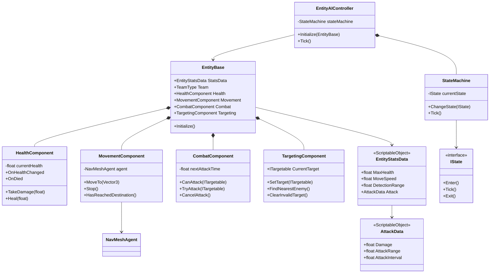

# 《MOBA Demo 迭代计划书》

## 1. 项目目标与架构约束

开发一个单机 Unity 3D 顶视角 MOBA Demo，验证以下最小玩法闭环：

> 玩家移动 → 搜索/选择目标 → 普通攻击 → 敌方单位 FSM 响应 → 小兵沿路线推进 → 防御塔交战 → 一方基地被摧毁。

核心技术约束：

- 使用 Unity 原生 `MonoBehaviour` 面向组件模式，不使用纯 ECS。
- 每个脚本只承担一个明确职责，避免“上帝类”。
- 静态数值通过 `ScriptableObject` 配置，运行时状态保存在组件实例中。
- AI 使用基础有限状态机（FSM）。
- 移动与追踪使用 Unity 内置 `NavMeshAgent`。
- 仅实现单机逻辑，不设计网络同步、预测、回滚或服务器权威。
- 第一版以可测试性优先，不提前建设复杂技能系统、装备系统或对象池框架。

---

## 2. 核心目录结构

```text
Assets/
├── Art/
│   ├── Animations/                 # 动画片段与 AnimatorController
│   ├── Materials/                  # 地面、角色、阵营材质
│   ├── Models/                     # 英雄、小兵、防御塔、基地模型
│   └── VFX/                        # 攻击、受击、死亡等表现资源
├── Audio/
│   ├── Music/
│   └── SFX/
├── Scenes/
│   ├── Bootstrap.unity             # 可选：全局初始化场景
│   ├── Gameplay.unity              # 主玩法场景
│   └── Test/
│       ├── MovementTest.unity
│       ├── CombatTest.unity
│       └── AITest.unity
├── Scripts/
│   ├── Core/
│   │   ├── EntityBase.cs           # 实体根对象与组件引用入口
│   │   ├── TeamType.cs             # 阵营枚举
│   │   ├── EntityType.cs           # 英雄、小兵、塔、基地类型
│   │   └── Interfaces/
│   │       ├── IDamageable.cs
│   │       ├── ITargetable.cs
│   │       └── IDeathHandler.cs
│   ├── Components/
│   │   ├── HealthComponent.cs      # 生命值、伤害、治疗、死亡判定
│   │   ├── MovementComponent.cs    # NavMesh 移动、停止、到达判断
│   │   ├── CombatComponent.cs      # 攻击距离、冷却、伤害结算
│   │   ├── TargetingComponent.cs   # 目标合法性、搜索与切换
│   │   └── AnimationComponent.cs   # 逻辑状态到动画参数的映射
│   ├── Controllers/
│   │   ├── PlayerInputController.cs
│   │   ├── PlayerCommandController.cs
│   │   └── CameraController.cs
│   ├── AI/
│   │   ├── FSM/
│   │   │   ├── IState.cs
│   │   │   └── StateMachine.cs
│   │   ├── EntityAIController.cs
│   │   └── States/
│   │       ├── IdleState.cs
│   │       ├── MoveState.cs
│   │       ├── ChaseState.cs
│   │       ├── AttackState.cs
│   │       └── DeadState.cs
│   ├── Units/
│   │   ├── HeroController.cs
│   │   ├── MinionController.cs
│   │   ├── TowerController.cs
│   │   └── BaseCoreController.cs
│   ├── Gameplay/
│   │   ├── LanePath.cs             # 路线节点数据与访问
│   │   ├── MinionSpawner.cs        # 按波次生成小兵
│   │   ├── MatchController.cs      # 开局、结束与胜负判定
│   │   └── SpawnPoint.cs
│   ├── UI/
│   │   ├── HealthBarView.cs
│   │   ├── SelectedTargetView.cs
│   │   └── MatchResultView.cs
│   └── Debug/
│       ├── EntityDebugView.cs
│       └── NavMeshDebugView.cs
├── ScriptableObjects/
│   ├── EntityStats/                # 英雄、小兵、防御塔基础属性
│   ├── Attacks/                    # 普攻伤害、距离、间隔配置
│   ├── Spawns/                     # 波次、数量、间隔配置
│   └── Match/                      # 对局规则配置
├── Prefabs/
│   ├── Characters/
│   │   ├── Heroes/
│   │   └── Minions/
│   ├── Buildings/
│   │   ├── Towers/
│   │   └── Bases/
│   ├── Gameplay/
│   │   └── SpawnPoints/
│   ├── UI/
│   └── VFX/
├── Settings/
│   ├── Input/
│   └── NavMesh/
└── Tests/
    ├── EditMode/
    └── PlayMode/
```

---

## 3. 核心类图设计



### 3.1 基类与接口

| 类型 | 职责 |
|---|---|
| `EntityBase` | 统一实体身份、阵营、配置数据及核心组件引用；只负责初始化和聚合，不直接处理移动或战斗。 |
| `IDamageable` | 暴露受伤入口与存活状态，使攻击逻辑不依赖具体单位类型。 |
| `ITargetable` | 暴露目标位置、阵营和可选中状态。 |
| `IDeathHandler` | 为英雄、小兵、建筑提供不同死亡后处理策略。 |
| `TeamType` | 定义玩家方、敌方和中立阵营，作为目标合法性判断依据。 |

### 3.2 核心组件

| 组件 | 单一职责 | 主要依赖 |
|---|---|---|
| `HealthComponent` | 管理当前生命、伤害、治疗和死亡事件。 | `EntityStatsData` |
| `MovementComponent` | 封装 `NavMeshAgent`，处理目标点移动、停止与到达判断。 | `NavMeshAgent` |
| `CombatComponent` | 管理攻击距离、攻击冷却和单次伤害结算。 | `AttackData`、`IDamageable` |
| `TargetingComponent` | 搜索敌人、保存目标、验证目标是否有效。 | `TeamType`、物理查询 |
| `AnimationComponent` | 将移动、攻击、死亡状态转换为 Animator 参数。 | `Animator` |
| `EntityAIController` | 收集环境条件并驱动状态机，不直接实现状态行为。 | `StateMachine` |

### 3.3 数据配置类

| 数据类 | 建议字段 |
|---|---|
| `EntityStatsData` | 最大生命、移动速度、索敌距离、旋转速度、攻击配置引用。 |
| `AttackData` | 基础伤害、攻击距离、攻击间隔、攻击前摇、命中方式。 |
| `MinionSpawnData` | 每波数量、生成间隔、波次间隔、单位预制体。 |
| `MatchConfigData` | 开局延迟、复活规则、胜负目标、默认阵营配置。 |

配置数据必须视为只读模板。`currentHealth`、攻击冷却和当前目标等运行时变量不得写回 `ScriptableObject`。

### 3.4 FSM 状态职责

- `IdleState`：无目标时等待或检查下一路径点。
- `MoveState`：沿路线或命令位置移动，并周期性检查敌人。
- `ChaseState`：追踪有效目标；目标失效或超出追击范围时退出。
- `AttackState`：进入攻击距离后停止移动，并按冷却触发攻击。
- `DeadState`：停止寻路和战斗，禁用选中与碰撞，播放死亡表现。
- 状态只编排组件能力，例如调用 `MoveTo()`、`TryAttack()`；不得自行修改生命值或直接操作 `NavMeshAgent`。

---

## 4. 关键运行流程

1. `EntityBase.Initialize()` 读取 `EntityStatsData`，初始化各功能组件。
2. 玩家右键地面时，`PlayerCommandController` 调用 `MovementComponent.MoveTo()`。
3. 玩家指定敌方目标，或 AI 通过 `TargetingComponent` 取得目标。
4. FSM 根据距离在 `ChaseState` 与 `AttackState` 之间切换。
5. `CombatComponent` 检查距离和冷却，通过 `IDamageable.TakeDamage()` 结算伤害。
6. `HealthComponent` 生命归零后发布 `OnDied` 事件，各单位控制器执行对应死亡处理。
7. 基地死亡后通知 `MatchController`，由其判定胜负并结束对局。

---

## 5. 分步开发里程碑

### 阶段一：场景、数据配置与玩家移动

**输入**

- 一个可烘焙 NavMesh 的测试地图。
- 玩家占位模型和地面碰撞体。
- `EntityStatsData` 基础移动配置。
- Unity Input System 或旧输入系统中的鼠标点击输入。

**开发范围**

- 建立 `EntityBase`、`MovementComponent` 和 `PlayerCommandController`。
- 完成顶视角相机跟随、平移和缩放。
- 通过鼠标点击地面发送移动命令。
- 提供不可达位置和 NavMesh 外点击的安全处理。

**验收标准**

- 玩家可连续点击不同位置，角色能稳定更新目的地。
- 角色绕过至少一个静态障碍物到达目标点。
- 点击 NavMesh 外区域不会报错或导致角色失控。
- 调整 `EntityStatsData.MoveSpeed` 后，无需修改脚本即可改变移动速度。

### 阶段二：生命、目标选择与基础战斗

**输入**

- 阶段一可移动角色。
- 一个敌方静态测试单位。
- `EntityStatsData` 和 `AttackData` 配置。
- 简易生命条预制体。

**开发范围**

- 实现 `HealthComponent`、`TargetingComponent` 和 `CombatComponent`。
- 支持选择敌方目标、追至攻击距离、按冷却执行普通攻击。
- 通过事件刷新生命条并处理死亡。
- 增加目标阵营、死亡状态和攻击距离校验。

**验收标准**

- 玩家不能攻击友方、已死亡或已销毁目标。
- 目标在攻击范围外时角色追击，进入范围后停止并攻击。
- 攻击间隔与伤害数值符合 `AttackData` 配置。
- 目标生命归零后只触发一次死亡事件，攻击与寻路立即停止。
- 更换配置资产后，可生成不同生命值和攻击力的单位。

### 阶段三：小兵 FSM 与自动交战

**输入**

- 阶段二完整战斗组件。
- 小兵预制体。
- 至少包含起点、中间点和终点的 `LanePath`。
- 蓝红双方测试单位。

**开发范围**

- 建立 `IState`、`StateMachine` 及五个基础状态。
- 小兵默认沿路线推进，在索敌范围内发现敌人后追击并攻击。
- 目标死亡或超出最大追击范围后，小兵返回路线继续推进。
- 增加 FSM 当前状态与目标的调试显示。

**验收标准**

- 无敌人时，小兵能够依次经过所有路线节点。
- 敌人进入索敌范围后，小兵在一个检测周期内进入追击状态。
- 接近目标后能从追击切换为攻击，目标死亡后恢复推进。
- 被引离路线超过限制时，小兵会放弃目标并返回路线。
- 连续生成至少 10 个小兵运行 3 分钟，无空引用异常或明显状态卡死。

### 阶段四：防御塔、兵线生成与胜负闭环

**输入**

- 阶段三的小兵 AI。
- 双方防御塔、基地和出生点预制体。
- `MinionSpawnData` 与 `MatchConfigData`。
- 简易对局结果 UI。

**开发范围**

- 实现 `MinionSpawner`，按配置定时生成双方兵线。
- 防御塔使用固定位置索敌与攻击逻辑，不使用移动组件。
- 基地实现生命值与死亡事件。
- `MatchController` 管理开局、运行、结束三个对局阶段。
- 补充攻击、受击、死亡动画或占位特效。

**验收标准**

- 双方能够按固定间隔自动生成小兵并沿相反方向推进。
- 防御塔只攻击有效敌方目标，目标离开范围或死亡后自动切换。
- 小兵、防御塔和基地复用同一套生命与伤害接口。
- 任一基地生命归零后停止生成单位、停止战斗逻辑并显示胜负结果。
- 从进入场景到对局结束可完整运行至少 5 次，无阻断流程的异常。

---

## 6. 推荐实施原则

- 组件间优先通过公开方法和 C# 事件协作，避免互相修改私有字段。
- 使用 `SerializeField` 暴露依赖，并在 `Awake()` 或 `OnValidate()` 中验证必需引用。
- AI 感知采用固定周期检测，而非所有单位每帧执行物理范围查询。
- 第一版不抽象复杂行为树、技能框架、属性修改器或全局事件总线。
- 测试应优先覆盖伤害结算、死亡仅触发一次、目标合法性和 FSM 状态切换。
- 完成四个阶段后，再评估对象池、技能系统、英雄复活、更多兵线和性能优化。
