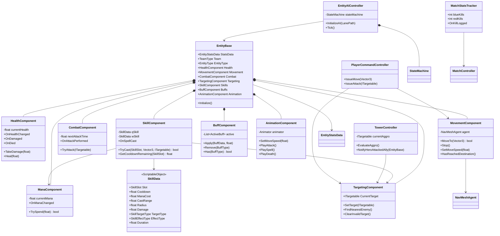

# 《MOBA Demo 迭代计划书》

> 本文档承载**实施细节与阶段计划**，需求权威以 `README.md` 为准。两者冲突时以 `README.md` 为准。
> 交付目标：**带有美术表现、核心机制完整、真正可玩的「简易版英雄联盟」（MOBA Vertical Slice）**。
> 阶段一 ~ 阶段五已完成；阶段六 ~ 阶段八为全新规划。

---

## 1. 项目目标与架构约束

开发一个单机 Unity 3D 顶视角 MOBA Demo，最终验证并交付完整玩法闭环：

> 玩家右键移动/普攻 → 释放指向性 / 非指向性技能 → 双方规律出兵 → 小兵沿兵线推进交战
> → 防御塔按仇恨优先级还击 → 推掉防御塔 → 摧毁敌方基地 → 判定胜负并展示对局信息。

### 核心技术约束

- 使用 Unity 原生 `MonoBehaviour` **组件化架构（ECS 风格）**，不使用纯 DOTS / ECS。
- 每个脚本只承担一个明确职责，避免"上帝类"。
- 静态数值通过 `ScriptableObject` 配置，运行时状态保存在组件实例中，**绝不回写资产**。
- AI 使用基础有限状态机（FSM）；**可移动单位分两条互斥路线**：AI 单位走 FSM，玩家英雄走玩家指令层。
- 移动与追踪使用 Unity 内置 `NavMeshAgent`。
- **表现与逻辑分离（最高优先级铁律）**：逻辑层单向广播事件，表现层只读订阅；**动画与特效绝不能反向影响伤害判定**。
- 仅实现单机逻辑，不设计网络同步、预测、回滚或服务器权威。
- **所有场景装配必须通过 Editor 脚本自动化完成，严禁手动拖拽依赖。**

### 关于"表现与逻辑分离"的边界说明（重要）

| 允许 | 禁止 |
|---|---|
| 逻辑层广播 `OnAttackPerformed` / `OnDamaged` / `OnDied` / `OnSpellCast` 事件 | 逻辑层直接引用 `Animator` / `ParticleSystem` / `AudioSource` / UI 组件 |
| 表现层订阅事件播放动画、特效、音效、飘字 | 用 **Animation Event** 回调伤害结算或修改战斗数值 |
| 动画播放速度按 `AttackInterval` 做视觉适配 | 让逻辑层**等待**动画播完才结算（逻辑节奏与动画长度解耦） |
| 表现层整体关闭 | 关闭表现后对局结果发生变化 |

> 说明：早期草案曾采用"动画事件驱动伤害"，该方案**已废弃**——它会让伤害判定依赖表现层，违反单向数据流。伤害判定的唯一权威是 `CombatComponent`（距离 + CD + 目标合法性）与 `SkillComponent`（CD + 蓝耗 + 施法距离 + 目标合法性）。

---

## 2. 核心目录结构（目标态）

```text
Assets/
├── Art/
│   ├── Models/                     # 🆕 角色与建筑模型（Heroes / Minions / Towers / Bases）
│   ├── Materials/                  # ✅ 地面、角色、阵营材质
│   ├── Animations/                 # 🆕 动画片段与 AnimatorController
│   ├── VFX/                        # 🆕 攻击、受击、技能特效预制体
│   └── Textures/                   # 🆕 地面贴图与 UI 贴图
├── Audio/
│   ├── Music/
│   └── SFX/
├── Scenes/
│   ├── MainScene.scene             # ✅ 主玩法场景（.scene）
│   └── Test/
├── Scripts/
│   ├── Core/
│   │   ├── EntityBase.cs           # ✅ 实体根对象与组件引用入口
│   │   ├── EntityRegistry.cs       # ✅ 实体登记（战场冻结用）
│   │   ├── TeamType.cs             # ✅ 阵营枚举
│   │   ├── EntityType.cs           # ✅ 英雄、小兵、塔、基地类型
│   │   └── Interfaces/
│   │       ├── IDamageable.cs      # ✅
│   │       ├── ITargetable.cs      # ✅
│   │       └── IStatusReceiver.cs  # 🆕 Buff/Debuff 接收接口（阶段六）
│   ├── Components/
│   │   ├── HealthComponent.cs      # ✅ 生命值、伤害、治疗、死亡判定
│   │   ├── ManaComponent.cs        # 🆕 法力值与消耗（阶段六）
│   │   ├── MovementComponent.cs    # ✅ NavMesh 移动、停止、到达判断
│   │   ├── CombatComponent.cs      # ✅ 攻击距离、冷却、伤害结算
│   │   ├── TargetingComponent.cs   # ✅ 目标合法性、搜索与切换
│   │   ├── SkillComponent.cs       # 🆕 技能释放唯一入口（阶段六）
│   │   ├── BuffComponent.cs        # 🆕 状态效果容器（阶段六）
│   │   └── AnimationComponent.cs   # 🆕 逻辑状态 → Animator 参数（阶段八）
│   ├── Controllers/
│   │   ├── PlayerCommandController.cs  # ✅ 右键移动/攻击指令
│   │   ├── PlayerSkillController.cs    # 🆕 技能按键输入（阶段六）
│   │   └── CameraController.cs         # ✅ 相机跟随、平移、缩放
│   ├── AI/
│   │   ├── FSM/{IState.cs, StateMachine.cs}   # ✅
│   │   ├── EntityAIController.cs              # ✅
│   │   └── States/{Idle,Move,Chase,Attack,Dead}State.cs   # ✅
│   ├── Units/
│   │   ├── HeroController.cs       # ✅ 英雄（无 FSM，走玩家指令层；含复活）
│   │   ├── MinionController.cs     # ✅
│   │   ├── TowerController.cs      # ✅ 防御塔（含仇恨优先级）
│   │   └── BaseCoreController.cs   # ✅
│   ├── Skills/                     # 🆕 技能数据与效果（阶段六）
│   │   ├── SkillSlot.cs            # Q / W 槽位枚举
│   │   ├── SkillTargetType.cs      # 敌方单位 / 友方单位 / 地面点 / 方向
│   │   ├── SkillEffectType.cs      # 伤害 / 护盾 / 减速 / 眩晕
│   │   ├── SkillData.cs            # ScriptableObject 技能配置
│   │   ├── SkillTargetSelector.cs  # 目标选择器（范围敌方 / 指定目标）
│   │   └── SkillEffectResolver.cs  # 效果结算（伤害 / 护盾 / 状态）
│   ├── Gameplay/
│   │   ├── LanePath.cs             # ✅
│   │   ├── MinionSpawner.cs        # ✅ 出生点直接持有 Transform，不引入 SpawnPoint 标记组件
│   │   ├── MatchController.cs      # ✅
│   │   └── MatchStatsTracker.cs    # 🆕 击杀/死亡统计与播报事件（阶段七）
│   ├── UI/
│   │   ├── MatchResultView.cs      # ✅
│   │   ├── WorldHealthBarView.cs   # 🆕 头顶世界空间血条（阶段七）
│   │   ├── DamagePopupView.cs      # 🆕 伤害飘字（阶段七）
│   │   ├── HeroHUDView.cs          # 🆕 头像、血/蓝条、技能 CD（阶段七）
│   │   ├── SkillSlotView.cs        # 🆕 单个技能图标 + CD 遮罩（阶段七）
│   │   ├── MinimapView.cs          # 🆕 小地图映射（阶段七）
│   │   ├── KillFeedView.cs         # 🆕 击杀播报（阶段七）
│   │   ├── ScoreboardView.cs       # 🆕 计分板（阶段七）
│   │   └── RespawnOverlayView.cs   # 🆕 复活倒计时遮罩（阶段七）
│   ├── VFX/                        # 🆕 表现层（阶段八）
│   │   ├── Projectile.cs           # 弹道（飞行时间 + 命中回调）
│   │   ├── VfxSpawner.cs           # 事件 → 特效/音效播放
│   │   └── SimpleObjectPool.cs     # 最小可用对象池
│   ├── Debug/
│   │   ├── FSMDebugView.cs         # ✅
│   │   ├── MatchDebugView.cs       # ✅
│   │   └── TowerAggroDebugView.cs  # 🆕 塔仇恨可视化（阶段六）
│   └── Editor/
│       └── AutoSceneBuilder.cs     # ✅ 一键组装（需持续升级，见 §6 铁律）
├── ScriptableObjects/
│   ├── EntityStats/                # ✅
│   ├── Attacks/                    # ✅
│   ├── Skills/                     # 🆕 Q / W 技能配置
│   ├── Spawns/                     # ✅
│   └── Match/                      # ✅
├── Prefabs/
│   ├── Characters/                 # 🆕 Heroes / Minions
│   ├── Buildings/                  # 🆕 Towers / Bases
│   ├── UI/                         # 🆕 血条、飘字、HUD、小地图
│   └── VFX/                        # 🆕 弹道、受击、技能特效
└── Settings/
    ├── Input/
    └── NavMesh/
```

---

## 3. 核心类图设计



### 3.1 基类与接口

| 类型 | 职责 |
|---|---|
| `EntityBase` | 统一实体身份、阵营、配置数据及核心组件引用；只负责初始化与聚合。 |
| `IDamageable` | 暴露受伤入口与存活状态，使攻击逻辑不依赖具体单位类型。 |
| `ITargetable` | 暴露目标位置、阵营和可选中状态。 |
| `IStatusReceiver` | 暴露状态效果接收入口（减速/眩晕/护盾），供 Buff 系统统一施加。 |
| `TeamType` | 定义玩家方、敌方和中立阵营，作为目标合法性判断依据。 |
| `EntityType` | 区分英雄 / 小兵 / 防御塔 / 基地，用于依赖校验与塔的仇恨优先级。 |

### 3.2 核心组件

| 组件 | 单一职责 | 主要依赖 |
|---|---|---|
| `HealthComponent` | 管理当前生命、伤害、治疗和死亡事件。 | `EntityStatsData` |
| `ManaComponent` | 管理当前法力、消耗与不足判定。 | `EntityStatsData` |
| `MovementComponent` | 封装 `NavMeshAgent`，处理目标点移动、停止与到达判断。 | `NavMeshAgent` |
| `CombatComponent` | 管理攻击距离、攻击冷却与单次伤害结算（**伤害判定权威**）。 | `AttackData`、`IDamageable` |
| `TargetingComponent` | 搜索敌人、保存目标、验证目标是否有效（**攻击指令的唯一存放处**）。 | `TeamType`、物理查询 |
| `SkillComponent` | 技能施放唯一入口：校验 CD / 蓝量 / 距离 / 目标合法性，扣蓝、起 CD、执行效果、广播事件。 | `SkillData`、`ManaComponent`、`TargetingComponent` |
| `BuffComponent` | 状态效果容器：施加、刷新、到期解除、查询（减速/眩晕/护盾）。 | `IStatusReceiver` |
| `AnimationComponent` | 将逻辑状态转换为 Animator 参数（**唯一允许引用 Animator 的组件**）。 | `Animator` |
| `EntityAIController` | 收集环境条件并驱动状态机，不直接实现状态行为。 | `StateMachine` |
| `TowerController` | 固定位置索敌 + 仇恨优先级评估 + 攻击；不持有移动组件。 | `CombatComponent`、`TargetingComponent` |

### 3.3 数据配置类

| 数据类 | 建议字段 |
|---|---|
| `EntityStatsData` | 最大生命、最大法力、移动速度、索敌距离、旋转速度、攻击配置引用。 |
| `AttackData` | 基础伤害、攻击距离、攻击间隔、攻击前摇、命中方式（即时 / 弹道）。 |
| `SkillData` | 槽位、图标、冷却、法力消耗、施法距离、作用半径、伤害/护盾值、效果类型、目标类型、持续时间。 |
| `BuffData` | 状态类型（减速/眩晕/护盾）、数值、持续时间、是否可叠加、刷新策略。 |
| `MinionSpawnData` | 每波数量、生成间隔、波次间隔、单位预制体。 |
| `MatchConfigData` | 开局延迟、复活时间、胜负目标、默认阵营配置。 |

配置数据必须视为只读模板。`currentHealth`、`currentMana`、攻击冷却和当前目标等运行时变量**不得写回 `ScriptableObject`**。

### 3.4 FSM 状态职责

- `IdleState`：无目标时等待或检查下一路径点。
- `MoveState`：沿路线或命令位置移动，并周期性检查敌人。
- `ChaseState`：追踪有效目标；目标失效或超出追击/牵引范围时退出。
- `AttackState`：进入攻击距离后停止移动，并按冷却触发攻击。
- `DeadState`：停止寻路和战斗，禁用选中与碰撞，播放死亡表现。
- 状态只编排组件能力（例如调用 `MoveTo()`、`TryAttack()`）；不得自行修改生命值或直接操作 `NavMeshAgent`。

---

## 4. 关键运行流程

1. `EntityBase.Initialize()` 读取 `EntityStatsData`，初始化各功能组件（**Combat 必须先于 Targeting**）。
2. 玩家右键地面 → `PlayerCommandController` 调用 `MovementComponent.MoveTo()`；右键敌方单位 → 写入 `TargetingComponent.CurrentTarget`。
3. 指令执行器每帧 `ClearInvalidTarget()` → 射程内 `Stop() + TryAttack()`，射程外按 `chaseRepathDistance` 追击。
4. 玩家按 Q/W → `PlayerSkillController` → `SkillComponent.TryCast()` 校验 CD / 蓝量 / 距离 / 目标合法性 → 扣蓝、起 CD、执行效果、广播 `OnSpellCast`。
5. 若技能/普攻命中方式为**弹道**，由 `Projectile` 飞行至目标后**在命中时**回调结算；逻辑层不等待表现。
6. AI 单位由 FSM 根据距离在 `ChaseState` 与 `AttackState` 之间切换。
7. `HealthComponent` 生命归零后发布 `OnDied`：单位控制器执行死亡处理；`MatchStatsTracker` 记录击杀并广播播报事件。
8. 英雄死亡 → 进入复活倒计时（UI 显示）→ 在己方出生点重生并恢复满状态。
9. 基地死亡后通知 `MatchController`，判定胜负、冻结战场并显示对局结果。
10. 防御塔每帧：`ClearInvalidTarget` → 超交战半径 `ClearTarget` → 节流评估仇恨优先级 → `TryAttack`。
11. 全程表现层（血条、飘字、特效、音效、小地图）只订阅事件，**不反向写入任何战斗数值**。

---

## 5. 分步开发里程碑

### 阶段一：场景、数据配置与玩家移动 ✅ 已完成

**输入**

- 一个可烘焙 NavMesh 的测试地图。
- 玩家占位模型和地面碰撞体。
- `EntityStatsData` 基础移动配置。
- Unity Input System 或旧输入系统中的鼠标点击输入。

**开发范围**

- 建立 `EntityBase`、`MovementComponent` 和 `PlayerCommandController`。
- 完成顶视角相机跟随、平移和缩放。
- 通过鼠标点击地面发送移动命令。
- 提供不可达位置和 NavMesh 外点击的安全处理。

**验收标准**

- 玩家可连续点击不同位置，角色能稳定更新目的地。
- 角色绕过至少一个静态障碍物到达目标点。
- 点击 NavMesh 外区域不会报错或导致角色失控。
- 调整 `EntityStatsData.MoveSpeed` 后，无需修改脚本即可改变移动速度。

---

### 阶段二：生命、目标选择与基础战斗 ✅ 已完成

**输入**

- 阶段一可移动角色。
- 一个敌方静态测试单位。
- `EntityStatsData` 和 `AttackData` 配置。
- 简易生命条预制体。

**开发范围**

- 实现 `HealthComponent`、`TargetingComponent` 和 `CombatComponent`。
- 支持选择敌方目标、追至攻击距离、按冷却执行普通攻击。
- 通过事件刷新生命条并处理死亡。
- 增加目标阵营、死亡状态和攻击距离校验。

**验收标准**

- 玩家不能攻击友方、已死亡或已销毁目标。
- 目标在攻击范围外时角色追击，进入范围后停止并攻击。
- 攻击间隔与伤害数值符合 `AttackData` 配置。
- 目标生命归零后只触发一次死亡事件，攻击与寻路立即停止。
- 更换配置资产后，可生成不同生命值和攻击力的单位。

---

### 阶段三：小兵 FSM 与自动交战 ✅ 已完成

**输入**

- 阶段二完整战斗组件。
- 小兵预制体。
- 至少包含起点、中间点和终点的 `LanePath`。
- 蓝红双方测试单位。

**开发范围**

- 建立 `IState`、`StateMachine` 及五个基础状态。
- 小兵默认沿路线推进，在索敌范围内发现敌人后追击并攻击。
- 目标死亡或超出最大追击范围后，小兵返回路线继续推进。
- 增加 FSM 当前状态与目标的调试显示。

**验收标准**

- 无敌人时，小兵能够依次经过所有路线节点。
- 敌人进入索敌范围后，小兵在一个检测周期内进入追击状态。
- 接近目标后能从追击切换为攻击，目标死亡后恢复推进。
- 被引离路线超过限制时，小兵会放弃目标并返回路线。
- 连续生成至少 10 个小兵运行 3 分钟，无空引用异常或明显状态卡死。

---

### 阶段四：防御塔、兵线生成与胜负闭环 ✅ 已完成

**输入**

- 阶段三的小兵 AI。
- 双方防御塔、基地和出生点预制体。
- `MinionSpawnData` 与 `MatchConfigData`。
- 简易对局结果 UI。

**开发范围**

- 实现 `MinionSpawner`，按配置定时生成双方兵线。
- 防御塔使用固定位置索敌与攻击逻辑，不使用移动组件。
- 基地实现生命值与死亡事件。
- `MatchController` 管理开局、运行、结束三个对局阶段。
- 补充攻击、受击、死亡动画或占位特效。

**验收标准**

- 双方能够按固定间隔自动生成小兵并沿相反方向推进。
- 防御塔只攻击有效敌方目标，目标离开范围或死亡后自动切换。
- 小兵、防御塔和基地复用同一套生命与伤害接口。
- 任一基地生命归零后停止生成单位、停止战斗逻辑并显示胜负结果。
- 从进入场景到对局结束可完整运行至少 5 次，无阻断流程的异常。

---

### 阶段五：英雄控制与自动化基建 ✅ 已完成

> **核心**：基于 Raycast 的右键移动/攻击指令、主相机平滑跟随 + 中键平移 + 滚轮缩放、`AutoSceneBuilder` 一键场景组装（含地面放大与 NavMesh 烘焙）与依赖注入。

**输入**

- 阶段一 ~ 四的完整战场（白盒英雄 + 兵线 + 塔 + 基地）。
- `PlayerCommandController`、`CameraController`、`AutoSceneBuilder`。
- 旧输入系统（`Input.GetMouseButtonDown(1)`）与 Layer `"Ground"` 射线拾取。
- 实机验证前置条件（已由工具自动满足）：地面覆盖战场范围 + 已烘焙 NavMesh。

**交付结果**

- `HeroController`：英雄身份（显示名 / 阵营 / 类型）+ 只读数据（生命 / 移速 / 攻击距离 / 存活）+ 英雄专属死亡收尾。**英雄刻意不挂 `EntityAIController`** —— FSM 会自主索敌并直接写 `MovementComponent` / `CombatComponent`，与玩家指令层争夺同一对组件的写入权（表现为「刚下达的移动令被 AI 改写」）。可移动单位因此分两条**互斥**路线：AI 单位走 FSM，玩家英雄走玩家指令层。英雄没有 `DeadState`，「死亡后原地静止、不再响应输入」由 `HandleDied` 承担。
- `PlayerCommandController`：右键 `Raycast`（`RaycastNonAlloc` 复用缓冲）同时获取敌方单位命中与地面命中，比较命中距离决定**攻击 / 移动**；点自己与友方忽略；点已死亡 / 已销毁单位被 `TargetingComponent.SetTarget` 的合法性校验拦下且不写入指令。攻击指令唯一存放于 `TargetingComponent.CurrentTarget`（全项目「当前目标」只有这一个存放处）。
- 指令执行器：每帧 `ClearInvalidTarget()` → 射程内 `Stop() + TryAttack()` / 射程外按 `chaseRepathDistance` 追击；**玩家指令不设牵引极限**（指令语义就是「打这个」）。`MovementComponent` 判空已提前到射程分支之前，无移动组件的单位不会每帧空引用。
- `CameraController`：固定世界偏移（默认 `(0, 10, -10)`，约 45° 俯角）+ `SmoothDamp`，在 `LateUpdate` 采样（Update 之后才是本帧最终位置），不跟随旋转。**平移与缩放是显示层增量**（`panOffset` / `zoomScale`，均不写进 `offset` 字段）：期望位置 = `目标 + offset × zoomScale + panOffset`，**注视点同步跟随 `panOffset`** —— 否则相机一边横移一边盯着英雄，平移会退化为「绕英雄转圈」，玩家永远推不开视野。
- `AutoSceneBuilder`：一键组装兵线、双方基地与出兵点、`MatchController`、**地面覆盖与 NavMesh 烘焙**、英雄（资产 / 材质 / 预制体 / 实例 / 相机跟随），并做缺口修补与收尾校验；**依赖注入零手工**（全部走 `SerializedObject` + `SerializedProperty`）。
- 步骤 8「地面覆盖、导航烘焙与手工残留自愈」：只放大不缩小 / 只动内置 Plane 网格 / 保持正方形；自动移除 Ground 上手工残留的 `NavMeshSurface` 组件；用现代 API `NavMeshBuilder.CollectSources`（配 `NavMeshBuildMarkup`）显式收集几何 + `BuildNavMeshData` 烘焙，再以 `EditorUtility.CopySerialized` **原地更新**场景的 NavMeshData 资产（保住 guid，场景引用不断链）→ `NavMesh.CalculateTriangulation()` 验证。**不再使用已弃用的 `StaticEditorFlags.NavigationStatic`（CS0618 已消除）**。
- 步骤 1 附加「幽灵对象清理」：名字命中接管清单、却不是场景根对象的游离副本（历史遗留：默认名空对象下挂着的 `BlueBase` / `RedBase` 副本，带残余 `EntityBase` 等组件）会被清掉，避免污染 `EntityRegistry`；判定规则收窄为「名字命中 + 有父节点」，清完即自限。

**本阶段的三条设计裁决（封版口径，不再复议）**

1. **`SpawnPoint.cs` 设计剔除**：`MinionSpawner` 直接持有出生点 `Transform` 即可完成落点绑定，再引入一个没有任何消费方的标记组件属于死代码，违反「单一职责 / 不建无用抽象」。**本阶段不实现该类**，`Assets/Scripts/Gameplay/` 只保留 `LanePath` / `MinionSpawner` / `MatchController`。
2. **相机平移只做中键拖拽**：**不做屏幕边缘平移** —— 边缘平移需要额外的边界阈值、鼠标离开窗口与全屏 / 窗口模式的差异化处理，收益不抵复杂度。中键双击回中作为唯一的视角复位入口。**以此为最终标准。**
3. **导航烘焙的唯一入口是工具，场景里不允许存在手工 `NavMeshSurface`**：手工挂的 `NavMeshSurface`（带 `[ExecuteAlways]`）会在编辑器里**再注册一份** navmesh 数据，且它引用的资产看起来「没人用」，极易被误删。工具在步骤 8 自愈式清理这类组件，并用现代 API 原地更新场景的 NavMeshData 资产。**推论（踩坑教训）**：任何**按 guid 被场景引用**的资产都不能用 `AssetDatabase.CreateAsset` 覆盖重建 —— 它会先删除旧资产、guid 随之改变、场景引用直接断链；必须**原地更新内容**（`EditorUtility.CopySerialized`）。

**开发范围（正式定义）**

- **英雄指令层**：Raycast 拾取 → 攻击/移动判定 → 指令执行器；支持连续下达与指令打断。
- **主相机**：平滑跟随 + 中键拖拽平移（双击回中）+ 滚轮缩放；`LateUpdate` 采样；编辑模式可即时摆位。
- **自动化基建**：`AutoSceneBuilder` 完成"清理旧场景 → 生成兵线/建筑/地面与 NavMesh/英雄/相机 → 注入全部 `[SerializeField]` 依赖 → 收尾校验"的全链路，**幂等且零手工拖拽**。
- 纯白盒验证：**本阶段不引入任何美术资产、动画或特效**。

**验收结果**

| 验收项 | 结论 | 依据 |
|---|---|---|
| 连续发出 20 次移动/攻击指令（含 NavMesh 外、点自己、点友方、点已死亡单位），零异常、零失控 | ✅ 闭环 | NavMesh 外 → `NavMesh.SamplePosition` 失败即忽略并告警；点自己 / 友方 → 跳过该命中并继续看它身后的地面；点已死亡单位 → `IsValidTarget` 校验拦下，指令不生效 |
| 点击敌方单位后英雄自动追至射程并持续平A；目标死亡后停止攻击且不残留失效指令 | ✅ 闭环 | 追击按 `chaseRepathDistance` 重寻路（含 `wasAttackingInPlace` 无条件重下，防「停下输出后卡死」）；射程内 `Stop() + TryAttack()`，冷却由 `CombatComponent` 判定；目标死亡 → `ClearInvalidTarget()` 清空 `CurrentTarget`，指令自然作废 |
| 相机跟随无抖动；平移与缩放不改变跟随目标与跟随偏移；连续平移/缩放 30 次无漂移 | ✅ 闭环 | `SmoothDamp` 在 `LateUpdate` 收敛；`target` / `offset` 字段无任何写入路径；平移夹在 `maxPanDistance` 内、缩放夹在 `[minZoomScale, maxZoomScale]` 内，无累积漂移 |
| 英雄在已烘焙 NavMesh 上无卡死；`MoveTo` 失败有一次告警且能自愈重试（不出现"永久卡死"） | ✅ 闭环 | `MoveTo` 返回 bool，失败不置「已下令」标记 → 下一帧自然重试；「代理不在 NavMesh 上」「目标点不可达」各只告警一次（`hasReportedXxx`） |
| **`AutoSceneBuilder` 幂等性**：连续执行 3 次，场景结构与依赖注入结果完全一致，无重复对象、无丢失引用 | ✅ 闭环 | 只按固定名字清理自己生成的对象；资产「缺失才创建、不覆盖」；地面「只放大不缩小」，第二次执行即判定为已覆盖 |
| **零手工验证**：全新克隆仓库 → 打开 `MainScene` → 执行一次菜单 → 直接 Play，完成一次完整对局（出兵 → 交战 → 基地摧毁 → 结算），全程**未在 Inspector 拖拽任何引用** | ✅ **实机确认** | 地面放大与 NavMesh 烘焙已由工具步骤 8 自动完成；右键移动控制已实机验证通过 |
| Profiler：白盒稳态 GC Alloc ≤ 1 KB/帧，单帧逻辑耗时 < 2 ms | ⏳ 待采样 | 需实机 Profiler 采样确认。**已知风险点**：`TargetingComponent.FindNearestEnemy` 使用 `Physics.OverlapSphere`（每次调用分配数组），单位数量上升时应替换为 `OverlapSphereNonAlloc` |

> **封版说明**：本阶段已实机验证「右键移动控制」与「一键组装（含地面 / NavMesh 前置）」；其余验收项为代码级闭环确认（逐条对照实现路径核对）。Profiler 指标属量化采样项，留待阶段六开发前用 Profiler 补测。

---

### 阶段六：技能系统与战斗拓展（核心玩法闭环）⏳ 待开发

> **核心**：引入完整的技能架构（`ScriptableObject` 驱动的 `SkillData`）。
> **机制**：指向性技能（弹道 Projectile）、非指向性 AOE 技能、基础 Buff/Debuff（减速、眩晕），以及技能 CD 与蓝耗管理。

**输入**

- 阶段五的英雄指令层与相机流。
- `TowerController`（已就位但尚未挂载到预制体/场景）。
- 技能数据结构设计（`SkillData` ScriptableObject）。
- 法力值组件 `ManaComponent`、状态效果容器 `BuffComponent`。

**开发范围**

**（1）技能系统架构**

- **数据层**：`SkillData`（槽位、图标、冷却、蓝耗、施法距离、作用半径、伤害/护盾值、效果类型、目标类型、持续时间）。
- **效果层**：`SkillEffectType`（伤害 / 护盾 / 减速 / 眩晕）+ `SkillTargetSelector`（范围内敌方 / 指定敌方单位 / 指定友方单位 / 地面点）+ `SkillEffectResolver`（效果结算）。
- **执行层**：`SkillComponent.TryCast(slot, groundPoint, target)` 唯一入口 —— 校验 CD → 蓝量 → 施法距离 → 目标合法性 → 扣蓝 → 起 CD → 执行效果 → 广播 `OnSpellCast`。
- **输入层**：`PlayerSkillController` 采集 Q/W 按键与鼠标位置（非指向性技能需要方向/落点）。
- 首批技能：**Q = 非指向性 AOE 伤害**；**W = 指向性控制或护盾**。

**（2）指向性技能与弹道**

- 锁定目标 → 发射 `Projectile`（真实飞行时间）→ **命中时**结算伤害与效果。
- 目标在弹道飞行途中死亡/销毁时，弹道须安全回收，不得空引用。

**（3）非指向性 AOE 技能**

- 以指定落点/方向为中心，`OverlapSphereNonAlloc` 收集范围内敌方单位并结算；友方与中立不受影响。
- 作用范围需要**白盒可视化**（Gizmos 或临时圆环）便于验证与调试。

**（4）Buff / Debuff**

- `BuffComponent` + `BuffData`：状态类型（减速 / 眩晕 / 护盾）、数值、持续时间、叠加与刷新策略。
- 减速：修改移动速度（只经 `MovementComponent.SetMoveSpeed()`，禁止直接改 `NavMeshAgent`）。
- 眩晕：禁止移动与攻击，到期自动解除。
- 护盾：优先吸收伤害，耗尽或到期移除。

**（5）CD 与蓝耗管理**

- `ManaComponent`：当前法力、消耗、不足判定，事件广播供 HUD 订阅。
- 技能冷却剩余时间可查询（供阶段七的 CD 遮罩读取）。

**（6）防御塔仇恨优先级**（承接需求，本阶段一并实现）

- 默认优先级 **小兵 > 英雄**（同级取最近）；敌方英雄在塔范围内攻击己方英雄 → **仇恨转移到该英雄**；目标死亡/离场/非法 → 重选；重评估节流 ≤ 0.25 s；**同一时刻单目标**。
- 新增 `TowerAggroDebugView` 可视化当前仇恨目标与优先级判定结果。

**验收标准**

- **技能拒绝路径**：CD 中 / 蓝量不足 / 超出施法距离 / 目标非法（友方、已死亡、已销毁）时，释放被拒绝且**不产生任何副作用**（不扣蓝、不起 CD、不播动画、不生成特效）。
- **Q（非指向性 AOE）**：范围内所有敌方单位受伤，友方零伤害；CD / 蓝耗 / 半径 / 伤害与 `SkillData` **完全一致**；改资产即可改技能，无需改代码。
- **W（指向性）**：护盾按配置吸收伤害并在耗尽/到期后正确移除；控制效果按配置时长生效并到期自动解除。
- **弹道**：有可见飞行时间，**命中与伤害结算严格一致**（不允许"先扣血、后飞弹"）；目标中途死亡时弹道安全回收，无空引用。
- **Buff/Debuff**：减速生效期间移速符合配置且到期恢复原值；眩晕期间无法移动与攻击；重复施加按既定策略（刷新时长）执行，不产生叠加失控。
- **蓝耗**：法力不足时无法施法；法力随时间/事件回复（若配置）符合预期。
- **塔仇恨**：默认打小兵；英雄 A 在塔范围内攻击己方英雄后，塔在 **1 个重评估周期（≤ 0.25 s）内**把仇恨切到英雄 A；英雄 A 离开交战半径或死亡后，塔在 1 个周期内回到小兵；**塔不会同时攻击两个目标**。
- 技能释放瞬间 GC Alloc ≤ 1 KB；战斗中不因技能产生持续 GC。
- **表现关闭一致性**：禁用全部技能特效后，技能伤害与胜负结果完全一致。

---

### 阶段七：信息可视化与对局 UI（玩家心流体验）⏳ 待开发

> **核心**：世界空间（World Space）血条显示、伤害飘字（Damage Popups）、小地图（Minimap）映射、屏幕顶部的击杀播报与计分板。
> **机制**：英雄死亡后的复活倒计时与出生点重生机制。

**输入**

- 阶段六的技能与战斗逻辑（白盒表现）。
- 血条、飘字、HUD、小地图预制体与 UI 素材。
- `MatchStatsTracker`（击杀/死亡统计与播报事件）。
- `MatchConfigData` 中的复活时间配置。

**开发范围**

**（1）世界空间血条**

- `World Space Canvas` 跟随单位头顶；敌我配色（敌方红 / 友方绿）；始终 billboard 朝向相机。
- 由 `OnHealthChanged` 事件驱动更新，**禁止每帧轮询**。
- **池化复用**，禁止每个单位 `Instantiate` 一个 Canvas；支持满血隐藏与超出视野裁剪。

**（2）伤害飘字**

- 伤害/治疗数字从受击位置飘出并淡出；由 `OnDamaged` 事件驱动。
- 必须池化；连续战斗下对象数量稳定。

**（3）玩家 HUD**

- 英雄头像（死亡置灰）、生命条、法力条、Q/W 技能图标 + **Radial Fill 冷却遮罩** + 秒数倒计时。
- 数据全部来自事件订阅（`OnHealthChanged` / `OnManaChanged` / 技能冷却查询）。

**（4）小地图**

- 世界坐标 → 小地图坐标映射；显示双方单位、防御塔与基地；英雄用更醒目的标记。
- 单位死亡/销毁后小地图标记同步移除，无残留。

**（5）击杀播报与计分板**

- `MatchStatsTracker` 统计双方击杀/死亡，广播播报事件。
- `KillFeedView`：屏幕顶部消息队列（谁击杀了谁），自动淡出，不阻塞不重叠。
- `ScoreboardView`：双方击杀数/死亡数实时显示。

**（6）复活机制**

- 英雄死亡 → 禁用输入与碰撞 → `RespawnOverlayView` 显示复活倒计时 → 倒计时结束在己方出生点重生并恢复满生命/满法力 → 恢复输入与可选中。
- 复活时间从 `MatchConfigData` 读取；对局结束时不再复活。

**验收标准**

- 血条位置与实体头顶偏差 **< 5 px**（1080p），billboard 始终朝向相机；同屏 20 个血条不产生逐帧 GC。
- 血条数值与实体实际生命实时一致（事件驱动，**无每帧轮询**）。
- **飘字**：每次伤害产生一个飘字，数值与 `TakeDamage` 实际扣血量一致；连续战斗 3 分钟后池对象数量稳定不增长。
- **HUD**：血/蓝条与实体数值一致；**CD 遮罩进度与技能实际可释放时刻一致（误差 ≤ 0.05 s）**；死亡时头像置灰且技能不可点。
- **小地图**：英雄标记位置与实际世界位置映射误差 ≤ 1 个标记宽度；单位死亡后标记 1 帧内移除。
- **击杀播报**：每次击杀恰好产生 1 条播报；连续 10 次击杀播报不重叠、不丢失、自动淡出。
- **计分板**：击杀数与 `MatchStatsTracker` 统计完全一致，无重复计数。
- **复活**：死亡到复活的耗时与 `MatchConfigData` 配置一致（误差 ≤ 0.1 s）；复活后满血满蓝、位置在己方出生点、可正常移动与施法；对局结束后不再复活。
- 同屏 30 单位 + 全部 UI 开启时 ≥ 60 FPS，UI 相关稳态 GC Alloc ≈ 0 B/帧。

---

### 阶段八：美术表现与表现层分离（最终商业化包装）⏳ 待开发

> **核心**：全面替换白盒胶囊体，导入标准的 3D 角色模型。
> **机制**：引入 Animator 状态机，将 FSM 逻辑状态映射到美术动画（Idle / Run / Attack / Death）。
> **视觉**：添加攻击特效（VFX）与基础音效（Audio），将地面替换为真正的 MOBA 贴图场景。

**输入**

- 阶段七的完整对局逻辑与 UI（白盒形态）。
- 标准 3D 模型：英雄、小兵、防御塔、基地。
- 动画片段：Idle / Run / Attack / Death（可选 Spell）。
- 特效资源（弹道、受击、技能）与音效资源（普攻、受击、技能、死亡、建筑摧毁）。
- MOBA 地面贴图与场景素材。
- 新建 `AnimationComponent`、`VfxSpawner`、`SimpleObjectPool`。

**开发范围**

**（1）模型替换**

- 模型挂到现有实体根节点下（根节点仍贴地、仍由 `NavMeshAgent` 驱动），逻辑组件位置不变。
- 阵营材质区分（蓝/红）；白盒保留为调试后备。

**（2）Animator 状态机（逻辑 → 表现的映射）**

- 五状态 `Idle / Run / Attack / Death`（+ 可选 `Spell`）；参数 `Speed`(float)、`Attack`(trigger)、`Spell`(trigger)、`Die`(trigger)。
- `Idle ↔ Run` 由 `Speed` 参数驱动过渡（约 0.1 s），不硬切状态，避免抖动。
- `AnyState → Death` 立即过渡，且**只播一次**。
- `AnimationComponent` 把逻辑状态映射为 Animator 参数，是**唯一允许引用 Animator 的组件**。

**（3）表现层与逻辑分离的最终验证**

- **Animation Event 只允许触发特效/音效**，严禁回调伤害结算（见 §1 边界说明）。
- 攻击节奏由 `AttackInterval` 决定，动画只做视觉匹配（必要时调整播放速度），**逻辑不等待动画**。
- **关闭全部动画/特效/音效后，对局逻辑与胜负结果必须完全一致**（本阶段必须实测通过）。

**（4）特效与音效**

- 普攻弹道、受击特效、技能特效（AOE 范围、护盾/控制）。
- 基础音效：普攻、受击、技能释放、死亡、建筑摧毁。
- 特效与音效走**对象池**（预生成 + 回收），禁止运行时 `Instantiate/Destroy` 抖动。

**（5）场景美术**

- 地面替换为真正的 MOBA 贴图场景（兵线视觉引导、区域化贴图），替换默认灰白 Plane。
- 确认贴图场景与 NavMesh 烘焙结果一致（地面视觉与可行走区域不矛盾）。

**（6）工具收尾**

- `AutoSceneBuilder` 升级为**一键组装带模型、动画、特效、音效与 UI 的完整可玩场景**（含全部依赖注入与 Animator 连线）。

**验收标准**

- **表现不影响逻辑（最高优先级）**：关闭全部动画/特效/音效后，同一局面下的伤害数值、击杀顺序与胜负结果**完全一致**。
- 四（五）个动画状态均能正确触发；`Idle ↔ Run` 过渡无抖动（连续小范围移动 10 次，不出现同帧来回切换）。
- 死亡动画只播放一次；死亡后 `Collider` 与 `NavMeshAgent` 被禁用，不再被索敌。
- **模型替换后逻辑代码零改动**（只改预制体、Animator 与表现层），验证表现层解耦成立。
- **弹道与命中一致**：弹道有可见飞行时间，命中位置与受击特效位置一致，伤害在命中时结算。
- 特效/音效对象池连续战斗 3 分钟后对象数量稳定不增长，无泄漏、无残留。
- 地面贴图场景与 NavMesh 可行走区域一致：右键点任意可见地面，英雄均可正常寻路（无"看着能走却点不动"的区域）。
- **综合性能**：同屏 30 单位 + 20 弹道 + 血条/飘字/HUD/小地图全开，目标机型 ≥ 60 FPS，战斗稳态 **GC Alloc ≈ 0 B/帧**。
- **一键交付验证**：全新克隆仓库 → 打开 `MainScene` → 执行一次 `AutoSceneBuilder` 菜单 → 直接 Play，即可完成一次带模型、动画、特效与 UI 的完整对局（出兵 → 交战 → 推塔 → 基地摧毁 → 结算），**全程零手工拖拽**。
- 完整跑通 **≥ 5 次**，无阻断流程的异常。

---

## 6. 开发铁律与推荐实施原则

### 6.1 铁律（不可违反）

1. **场景装配全自动化**：所有场景装配**必须通过 Editor 脚本完成**（`AutoSceneBuilder`），**严禁手动拖拽依赖**。
   - 凡需要被工具注入的字段必须标 `[SerializeField]`，由 `SerializedObject` / `SerializedProperty` 写入。
   - 手工在 Inspector 里拖的引用**不算交付**：必须回写到工具脚本，否则场景重建即丢失。
   - 工具必须**幂等**：重复执行结果一致；且只按固定名字清理自己生成的对象，不做全场景组件扫描删除。
2. **表现与逻辑分离**：逻辑层禁止引用 Animator / VFX / Audio / UI；**动画事件与特效绝不能反向影响伤害判定**。
3. **配置只读**：运行时不回写 `ScriptableObject`。
4. **单一职责**：禁止"上帝类"；组件间通过公开方法与 C# 事件协作，禁止跨类改私有字段。
5. **依赖自校验**：`Awake()` 校验必需依赖，缺失即 `LogError` 并 `enabled = false`，不允许静默失败。
6. **静态检查前置**：所有 `.cs` 为 UTF-8 with BOM；提交前运行项目内置结构检查脚本。

### 6.2 推荐实施原则

- 使用 `SerializeField` 暴露依赖，并在 `Awake()` 或 `OnValidate()` 中验证必需引用。
- AI 感知采用固定周期检测（节流），而非所有单位每帧执行物理范围查询。
- 状态切换采用滞回死区设计，防止边界距离上反复横跳。
- 对象池只覆盖**弹道、特效与 UI 元素**；不提前泛化到全部实体，也不引入全局事件总线。
- 技能系统保持最小可用：数据 + 效果 + 执行 + 表现四层，不建行为树、不做连招编辑。
- 测试优先覆盖：伤害结算、死亡仅触发一次、目标合法性、FSM 状态切换、塔仇恨切换、技能拒绝路径（CD / 蓝量 / 距离 / 非法目标）、**表现关闭后的结果一致性**。
- 性能验收以 Profiler 数据为准（逻辑 < 2 ms/帧、战斗稳态 GC Alloc ≈ 0 B/帧），拒绝"感觉卡"的臆断式优化。
- 完成阶段八后，再评估多兵线、野区、装备经济与网络同步。
